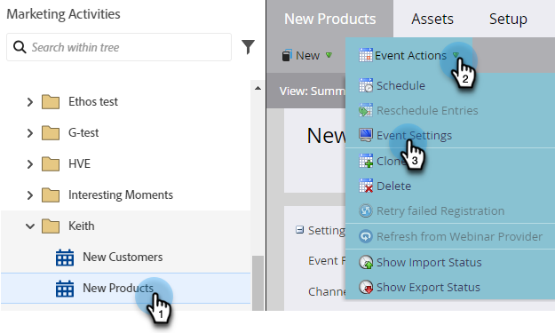

# [!DNL Webex]&#x200B;(으)로 이벤트 만들기 {#create-an-event-with-webex}

Webex에서 웨비나를 만든 후에는 이벤트를 Marketo Engage과 동기화해야 합니다.

>[!PREREQUISITES]
>
>* [추가 [!DNL Webex] as a [!DNL LaunchPoint] 서비스](/help/marketo/product-docs/administration/additional-integrations/add-webex-as-a-launchpoint-service.md)
>* [새 이벤트 프로그램 만들기](/help/marketo/product-docs/demand-generation/events/understanding-events/create-a-new-event-program.md)
>* 참여를 추적하려면 적절한 [흐름 동작](/help/marketo/product-docs/core-marketo-concepts/smart-campaigns/flow-actions/add-a-flow-step-to-a-smart-campaign.md)을 설정하십시오.

## 웨비나 예약 {#schedule-your-webinar}

[Webex](https://www.webex.com/){target="_blank"}에서 이벤트를 예약하고 기본 설정을 선택합니다. 웨비나 이름, 시작/종료 날짜 및 시간, 시간대 및 설명 정보만 Marketo에서 볼 수 있습니다. Webex 웨비나 [에 대한 추가 정보는 여기에서 찾을 수 있습니다](https://help.webex.com/en-us/landing/ld-7srxjs-WebexWebinars/Webex-Webinars){target="_blank"}.

### 기본 정보 {#basic-information}

* **[!UICONTROL Event Name]-** 이 이름은 Marketo에서 볼 수 있습니다.
* **[!UICONTROL Unlisted Checkbox]**
* **항목**: 사용자의 이벤트 이름이며 Marketo에서 볼 수 있습니다.
* **날짜 및 시간**: 시작/종료 날짜, 시작/종료 시간, 기간 및 시간대는 모두 Marketo에서 볼 수 있습니다.
* **최대 참석자 수**: 최대 참석자 수에 따라 지원되는 Webex 기능이 결정됩니다.
* **참석자에 대한 웹캐스트 보기**: 웨비나를 모든 참석자에게 라이브로 스트리밍하려면 이 항목을 선택하십시오.
* **토론자**: 웨비나에서 특정 사람을 토론자로 초대합니다.
* **웨비나 주제**: 패널 구성원에게 보낸 전자 메일 초대에 컨텍스트를 제공하려면 이 항목을 채웁니다.

### 보안 {#security}

* **웨비나 암호**: (선택 사항) 이 필드를 사용하는 경우 확인 전자 메일에 해당 필드를 포함해야 합니다.
* **패널 암호**: (선택 사항) 이 필드를 사용하는 경우 웨비나 안건에 반드시 포함하십시오.
* **계정 필요**: 참석자를 Webex 계정이 있는 사람으로만 제한합니다.

### 오디오 연결 옵션 {#audio-connection-options}

* **오디오 연결 유형**: 웨비나 참가자가 웨비나의 오디오 부분에 참여하는 방법을 선택하십시오.
* **시작 및 종료 신호음**: 다른 사람이 웨비나에 들어오거나 나갈 때 사용자가 원하는 소리를 선택합니다(전화 오디오 연결 필요).
* **패널 음소거**: 원하는 패널 음소거 설정을 선택하십시오.

### 고급 옵션 {#advanced-options}

* **자동 녹화**: 웨비나를 자동으로 기록하려면 이 옵션을 선택하십시오.
* **연습 세션**: 웨비나가 시작될 때 연습 세션이 시작되도록 하려면 이 옵션을 선택하십시오.
* **브레이크아웃 세션**: 브레이크아웃 세션을 사용하면 웨비나가 시작되기 전에 패널 및 참석자를 미리 할당하거나 웨비나 중에 패널 참여자를 추가할 수 있습니다.
* **웨비나 시리즈**: 웨비나 시리즈에 추가하면 공개 여부에 관계없이 웨비나를 볼 수 있습니다.
* **등록**: 참석자가 참석하기 전에 등록하고 호스트 승인을 받아야 합니다.
* **전자 메일 미리 알림**: 웨비나가 시작되기 15분에서 최대 2일 전까지 전자 메일 미리 알림을 선택하십시오.
* **웨비나 옵션**: 웨비나 참가자가 사용할 수 있는 기능을 결정합니다.
* **참가자 권한**: 참가자 권한은 웨비나 참가자가 사용할 수 있는 작업을 결정합니다.

>[!NOTE]
>
>Marketo-Webex 통합은 Webex에서 확인 이메일 전송을 지원할 수 없습니다. 확인 메일은 Marketo을 통해 전송되어야 합니다. 이벤트를 예약한 후에는 Marketo 확인 전자 메일에 이벤트 정보를 복사하고 전자 메일을 _작동_(으)로 설정하십시오.

## Marketo Engage과 이벤트 동기화 {#sync-your-event-with-marketo-engage}

1. Marketo에서 원하는 이벤트 프로그램을 찾아 선택합니다. **이벤트 작업** 드롭다운에서 **이벤트 설정**&#x200B;을 선택합니다.

   

   >[!NOTE]
   >
   >선택한 이벤트의 채널 형식은 **웨비나**&#x200B;여야 합니다.

1. **이벤트 파트너** 드롭다운에서 **Webex 웨비나**&#x200B;를 선택합니다.

   

1. **로그인** 드롭다운에서 Webex 로그인을 선택합니다.

   

1. **이벤트** 드롭다운에서 Webex 이벤트를 선택합니다.

   

1. 웨비나 세부 정보가 채워집니다. **저장**&#x200B;을 클릭합니다.

   

이제 Webex 이벤트가 Marketo 이벤트 프로그램과 동기화됩니다. 새 상태가 &quot;등록됨&quot;으로 설정되면 웨비나에 등록한 사용자가 _프로그램 상태 변경_ 흐름 단계를 통해 웨비나 공급자에게 푸시됩니다. 다른 상태는 사용자를 밀어내지 않습니다. _프로그램 상태 변경_ 흐름 단계 #1 및 _전자 메일 보내기_ 흐름 단계를 #2.

## 참고할 사항 {#things-to-note}

* 중첩된 이메일 프로그램 을 사용하여 확인 이메일을 발송하지 마십시오. 대신 이벤트 프로그램의 스마트 캠페인을 사용하십시오.

* Marketo에 데이터가 표시되는 데 최대 48시간이 걸릴 수 있습니다. 그렇게 오래 기다린 후에도 아무것도 표시되지 않으면 이벤트 프로그램의 **요약** 탭에서 **이벤트 작업** 드롭다운에서 **웨비나 공급자에서 새로 고침**&#x200B;을 클릭하세요.
