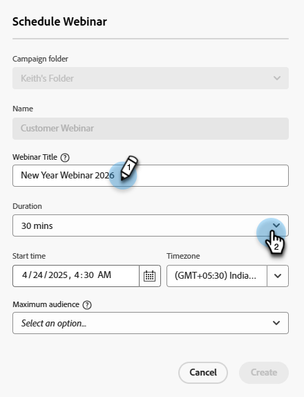

# 대화형 웨비나 만들기 {#create-an-interactive-webinar}

몇 가지 간단한 단계로 대화형 웨비나를 만듭니다.

1. 다음으로 이동 **마케팅 활동**.

   

1. 원하는 폴더를 마우스 오른쪽 단추로 클릭하고 를 선택합니다 **새 프로그램**.

   

1. 프로그램 이름을 지정합니다. 프로그램 유형에서 **이벤트**.

   

1. 채널 드롭다운을 클릭하고 _웨비나를 사용하는 이벤트_ 적용 대상 열에서 다음을 수행합니다. 이 예제에서는 **웨비나**.

   

   >[!NOTE]
   >
   >적용 대상 채널 확인 _웨비나를 사용하는 이벤트_&#x200B;로 이동합니다. **관리자** > **태그**. &quot;적용 대상&quot;은 가운데 열이어야 합니다. 의 5단계에서 &quot;적용 대상&quot;에 대해 자세히 알아보기 [이 문서](/help/marketo/product-docs/administration/tags/create-a-program-channel.md){target="_blank"}.

1. 선택 **대화형 웨비나** 및 클릭 **다음**.

   

   >[!NOTE]
   >
   >파트너 웨비나에 대한 정보는 여기에서 확인할 수 있습니다.

1. 웨비나의 최대 대상 크기와 지속 시간을 설정합니다.

   

1. 웨비나 날짜/시간을 예약하고 **만들기**.

   

대화형 웨비나가 만들어집니다. 이제 웨비나 팀을 추가할 수 있습니다.

## 웨비나 팀 {#webinar-team}

대화형 웨비나의 웨비나 팀은 Adobe Connect에서 웨비나를 성공적으로 전달하는 데 기여하는 모든 역할로 구성됩니다. 여기에는 발표자와 공동 호스트가 모두 포함됩니다.

>[!NOTE]
>
>Marketo의 발표자 및 공동 호스트는 Adobe Connect의 웨비나 게재 중 발표자 및 공동 호스트의 역할에 정확히 매핑됩니다.

발표자는 웨비나 경험 전달에 참여하는 외부 역할이지만 공동 주최자는 발표자 역할을 할 수 있을 뿐만 아니라 웨비나 전달의 관리 측면도 처리할 수 있습니다. 공동 호스트는 내부 및 외부일 수 있습니다. 외부 공동 호스트는 Marketo의 대화형 웨비나 이벤트 프로그램에 액세스할 수 없지만 Adobe Connect에서 전달하는 동안 공동 호스트 권한을 갖게 됩니다. 내부 공동 호스트는 Marketo의 대화형 웨비나 이벤트 프로그램과 게재 중 공동 호스트 권한 모두에 액세스할 수 있습니다. 이렇게 하면 대화형 웨비나 프로그램의 원래 작성자가 대화형 웨비나 사용자 세트의 일부가 아니거나 Marketo 사용자가 아닐 때 내부 공동 호스트가 대화형 웨비나 이벤트 프로그램의 고삐를 쥘 수 있습니다.

### 웨비나 팀 추가 {#adding-a-webinar-team}

공동 호스트 또는 발표자를 추가하려면 **공동 호스트 추가** 또는 **발표자 추가** 개요 화면에서 다음을 수행합니다.

클릭 시 **발표자 추가**&#x200B;이름, 성 및 이메일 주소를 입력하라는 메시지가 표시됩니다. 이 정보는 웨비나 게재 중에 Adobe Connect에서 사용할 수 있으므로 웨비나 게재를 위한 항목 중에 사용자가 입력할 필요 없이 적절한 세부 정보를 자동으로 채울 수 있습니다. 조인 URL은 모든 발표자에 대해 채워지며, 작성자가 공유할 수 있습니다.

클릭 시 **공동 호스트 추가**&#x200B;을 선택하면 내부 또는 외부 사용자를 추가하라는 메시지가 표시됩니다. 내부를 선택하는 경우 Marketo Engage에서 대화형 웨비나 사용자로 추가된 모든 사용자 목록에서 원하는 사용자를 선택할 수 있습니다. [외부]를 선택하는 경우 발표자를 추가하는 프로세스와 유사하게 이름, 성 및 이메일 ID를 추가하라는 메시지가 표시됩니다. 내부 사용자와 외부 사용자가 모두 공유할 수 있도록 가입 URL을 가져올 수도 있습니다.

웨비나 팀을 추가한 후 각 사용자 옆에 있는 복사 아이콘을 클릭하여 가입 URL을 복사(그런 다음 공유)할 수 있습니다.

 

자, 이제 [웨비나 디자인](/help/marketo/product-docs/demand-generation/events/interactive-webinars/designing-interactive-webinars.md){target="_blank"}.
