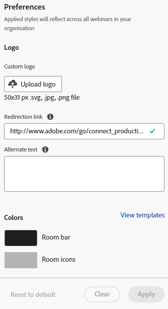

# 대화형 웨비나 사용자 지정 {#interactive-webinars-customization}

웨비나를 맞춤화하는 것은 참가자에게 보다 매력적이고 효과적인 경험을 제공하는 데 중요합니다.

대화형 웨비나는 웨비나 환경을 사용자의 요구 사항에 맞게 조정할 수 있는 몇 가지 사용자 지정 옵션을 제공합니다. 조직의 브랜딩을 반영하도록 다양한 화면의 모양을 사용자 지정합니다.

다음 옵션을 사용자 지정할 수 있습니다.

* 룸의 브랜드 색상
* 시작, 종료 및 대기 화면에서 조직을 나타내는 사용자 지정 배경
* 로고
* 가상 비디오 배경

## 권한 부여 {#grant-permissions}

조직의 사용자가 대화형 웨비나를 사용자 정의할 수 있으려면 먼저 Marketo Engage 관리자가 원하는 역할에 액세스 권한을 추가해야 합니다.

1. Marketo Engage에서 **[!UICONTROL Admin]**&#x200B;을 클릭합니다.

   

1. **[!UICONTROL Users & Roles]**&#x200B;을(를) 클릭한 다음 **[!UICONTROL Roles]** 탭을 클릭합니다.

   

1. 권한을 추가할 역할을 두 번 클릭합니다.

   

1. **[!UICONTROL Access Design Studio]**&#x200B;을(를) 열려면 클릭하세요.

   

1. **[!UICONTROL Access Interactive Webinars Customization]** 확인란을 선택합니다.

   

## 대화형 웨비나 화면 사용자 지정 {#customize-interactive-webinar-screens}

1. **디자인 스튜디오**(으)로 이동합니다.

   

1. **대화형 웨비나**&#x200B;를 클릭하고 **웨비나 사용자 지정**&#x200B;을 선택합니다.

   

1. Room 인터페이스, Immediate 화면 또는 가상 비디오 배경을 사용자 지정할 수 있습니다.

   

### 룸 인터페이스 사용자 정의 {#customize-the-room-interface}

로고, 클릭 가능한 리디렉션 링크 및 색상을 변경하여 세션 룸의 모양을 사용자 지정할 수 있습니다. 변경 사항은 조직의 모든 이벤트와 룸에 반영됩니다.

룸의 모양을 사용자 지정하려면 메뉴 모음에서 룸 인터페이스 탭을 선택합니다.

1. 오른쪽 패널에서 다음 기본 설정을 사용자 지정합니다.

   

   **사용자 지정 로고**: 로고 업로드를 선택하고 장치에서 이미지를 찾아봅니다. 이미지 크기는 50 x 31픽셀을 초과할 수 없으며 .svg, .gif, .jpg 및 .png 파일 형식일 수 있습니다. 로고를 변경하거나 삭제할 수 있습니다.

   **리디렉션 링크**: 참석자가 로고를 클릭한 후 리디렉션할 URL을 추가합니다.

   **대체 텍스트**: 접근성 기능을 사용하여 참석자를 위한 대체 텍스트를 추가하십시오.

   **색상**: 룸 막대, 룸 아이콘, 룸 배경, Pod 막대 및 Pod 타일/아이콘의 색상을 선택하여 다른 섹션의 색상을 변경합니다.

   HEX 옵션을 사용하여 HEX 색상 코드를 입력할 수도 있습니다.

   회의실 테마를 변경하려면 **[!UICONTROL View templates]**&#x200B;을(를) 선택하세요.

   변경 후 미리보기에서 로고와 색상을 확인할 수 있습니다.

1. 변경 내용을 저장하려면 **[!UICONTROL Apply]**&#x200B;을(를) 선택하십시오. 기본 설정으로 재설정하려면 **[!UICONTROL Reset to default]**&#x200B;을(를) 클릭합니다.

   

### 중간 화면 사용자 지정 {#customize-intermediate-screens}

배경 이미지를 변경하여 시작, 종료 및 대기 화면의 모양과 느낌을 변경합니다. 변경 사항은 조직의 모든 이벤트와 룸에 반영됩니다.

룸의 모양을 사용자 지정하려면 메뉴 모음에서 중간 화면 탭을 선택합니다.

1. 오른쪽 패널에서 **이미지 업로드**&#x200B;를 선택하여 배경 이미지를 사용자 지정하고 로고 이미지를 찾습니다. 이미지 크기는 1920 x 1080 픽셀을 초과할 수 없으며 .svg, .gif, .jpg 및 .png 파일 형식일 수 있습니다. 원하는 경우 로고를 변경하거나 삭제할 수 있습니다.

   

   >[!NOTE]
   >
   >업로드된 이미지는 시작, 종료 및 대기 화면에 적용됩니다.

1. 변경 내용을 저장하려면 **[!UICONTROL Apply]**&#x200B;을(를) 선택하십시오. 기본 설정으로 재설정하려면 **[!UICONTROL Reset to default]**&#x200B;을(를) 클릭합니다.

### 가상 비디오 배경 사용자 지정 {#Customize-virtual-video-backgrounds}

이벤트 중에 조직 정의 배경을 사용하여 카메라 비디오 피드의 배경에 조직의 로고 또는 브랜드 이미지를 표시하십시오. 조직의 가상 배경을 추가하려면 메뉴 모음에서 가상 비디오 배경 탭을 선택합니다. 사용자 지정 배경, Adobe Connect 배경 또는 둘 다 표시하도록 선택할 수 있습니다.

**사용자 지정 배경**

1. 토글 스위치를 클릭하여 이벤트 및 룸에서 사용자 지정 배경을 허용합니다.

   

1. 사용자 지정 배경을 업로드하려면 **배경 업로드**&#x200B;를 선택하십시오. 이미지 크기는 1920 x 1080 픽셀을 초과할 수 없으며 .svg, .gif, .jpg 및 .png 파일 형식일 수 있습니다.

비디오 배경에서 삭제하려면 사용자 지정 배경 이미지에 마우스를 가져다 대십시오.

변경 작업을 수행한 후 미리보기에서 배경을 봅니다.

[미리 보기] 화면의 슬라이더를 사용하여 확대하거나 축소하여 사용자가 카메라에 가깝거나 먼 경우 가상 배경이 어떻게 보이는지 테스트할 수 있습니다. 백그라운드에 텍스트가 있는 경우 계속 표시되도록 하는 데 도움이 됩니다.

1. 변경 내용을 저장하려면 **[!UICONTROL Apply]**&#x200B;을(를) 선택하십시오. 기본 설정으로 재설정하려면 **[!UICONTROL Reset to default]**&#x200B;을(를) 클릭합니다.

**Adobe Connect 배경**

Adobe Connect은 사용할 준비가 된 9개의 기본 배경을 제공합니다. 미리보기에서 모양을 볼 수 있습니다.

토글 스위치를 사용하여 이벤트 및 룸에서 이러한 기본 배경의 가용성을 제어합니다.

**적용**&#x200B;을 선택하여 변경 내용을 저장하거나 **기본값으로 재설정**&#x200B;을 선택하여 기본 설정으로 재설정합니다.
