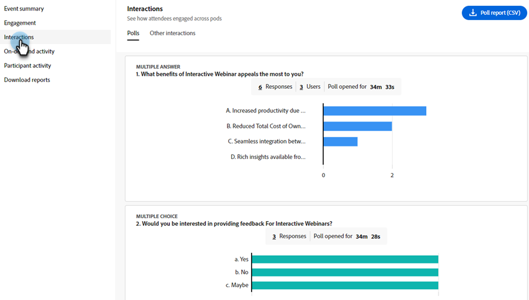
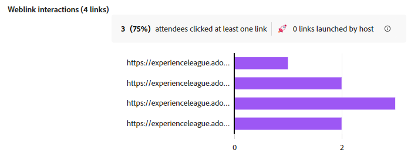

# 참여 대시보드 {#engagement-dashboard}

Adobe Connect에서 제공하는 대화형 웨비나는 다양한 pod를 사용하여 참가자를 채팅, 질문 및 답변, 퀴즈, 투표에 참여시킵니다. 참여 대시보드를 사용하면 주요 지표 및 데이터 시각화를 추적할 수 있습니다.

참가자 활동, 상호 작용 및 이벤트 중 참여에 대한 통합된 보기를 참조하십시오. 호스트로서 라이브 및 온디맨드 이벤트의 성능을 보고 세션 후 다양한 보고서를 다운로드할 수 있습니다. 또한 대시보드에서 생성된 포스트 웨비나 보고서를 사용하여 세션의 효과를 평가하고 향후 컨텐츠를 알리며 전반적인 웨비나 전략을 향상시킵니다.

대시보드는 투표 응답, 채팅 활동 및 비디오 상호 작용을 포함한 다양한 지표를 추적하여 참가자의 선호도 및 행동에 대한 중요한 통찰력을 제공합니다. 참여자 활동 및 참여 수준에 대한 포괄적인 개요를 제공하여 호스트가 실시간 출석, 참여 및 상호 작용을 모니터링할 수 있도록 합니다.

대화형 웨비나에서 다음 유형의 세션에 대한 참여를 봅니다.

* **실시간 세션**: 참가자가 서로 적극적으로 참여할 수 있는 실시간 온라인 세션입니다.
* **온디맨드 세션**: 라이브 이벤트 녹화는 자체 이벤트로 사용할 수 있습니다. 신규 초대자는 등록하고 녹음을 볼 수 있습니다. 등록 후 이벤트 가입 링크를 받게 되며, 이 링크를 통해 이벤트 종료 후 이벤트 녹화로 이동합니다. 라이브 이벤트에 등록된 참여자는 동일한 가입 링크를 사용하여 녹화를 볼 수도 있습니다.

## 대시보드 보기 {#view-the-dashboard}

1. **[!UICONTROL 마케팅 활동]**(으)로 이동합니다.

   

1. 원하는 이벤트를 선택합니다.

   

1. 개요에서 **[!UICONTROL 참여 대시보드 보기]**&#x200B;를 클릭합니다.

   

   >[!NOTE]
   >
   >참여 대시보드는 예약된 이벤트가 종료된 후 45~120분 후에 액세스할 수 있습니다.

## 대시보드 세부 정보 {#dashboard-details}

참여 대시보드에서 다음 세부 정보를 볼 수 있습니다.

<table><tbody>
  <tr>
    <td><b>이벤트 요약</td>
    <td>라이브 및 온디맨드 세션의 성능을 통합적으로 파악할 수 있습니다.</td>
  </tr>
  <tr>
    <td><b>참여</td>
    <td>라이브 세션의 성능에 대한 개요를 제공합니다.</td>
  </tr>
  <tr>
    <td><b>상호 작용</td>
    <td>Pod에서 참가자의 참여를 자세히 볼 수 있습니다.</td>
  </tr>
  <tr>
    <td><b>온디맨드 활동</td>
    <td>녹음/녹화 성능에 대한 요약을 제공합니다.</td>
  </tr>
  <tr>
    <td><b>참가자 활동</td>
    <td>참여에 대한 통합된 뷰를 제공합니다.</td>
  </tr>
  <tr>
    <td><b>보고서 다운로드</td>
    <td>다양한 Pod의 참여 보고서를 다운로드하십시오.</td>
  </tr>
</tbody>
</table>

### 이벤트 요약 {#event-summary}

이 인터페이스에서는 라이브 및 온디맨드 세션에 대한 이벤트 성능을 통합적으로 볼 수 있습니다. 왼쪽 패널에서 이벤트 요약 을 선택하여 전체 지표를 확인합니다.

<table><tbody>
  <tr>
    <td><b>총 등록</td>
    <td>이는 이벤트에 등록한 참여자 수를 보여 줍니다.</td>
  </tr>
  <tr>
    <td><b>총 참석자 수</td>
    <td>이는 행사에 참석한 참가자들의 수를 보여준다.</td>
  </tr>
  <tr>
    <td><b>등록에서 참석자 전환율</td>
    <td>이는 이벤트에 등록하고 참석한 참가자의 비율을 보여 줍니다.</td>
  </tr>
  <tr>
    <td><b>시청자는 라이브 및 온디맨드 모두 참석했습니다.</td>
    <td>이는 라이브 이벤트와 온디맨드 이벤트에 모두 참석한 참여자의 수를 보여줍니다.</td>
  </tr>
</tbody>
</table>

### 참여 {#engagement}

이벤트의 라이브 세션 성능에 대한 개요를 제공합니다. 이 개요에는 주요 지표, 시간 경과에 따른 참여 및 참가자 상호 작용이 포함되어 있습니다. 이는 주최자가 이벤트의 성공을 평가하고 개선 영역을 식별하는 데 도움이 됩니다.

왼쪽 패널에서 **[!UICONTROL 참여]**&#x200B;를 선택하여 라이브 세션의 성능을 확인합니다. **[!UICONTROL 참여 요약(PDF)을 클릭합니다]** 실시간 세션의 성능 요약을 다운로드합니다. 개요에서는 여러 섹션의 데이터를 제공합니다.

**주요 지표**

라이브 세션의 등록, 참석자 및 참여 수를 봅니다.

<table><tbody>
  <tr>
    <td><b>등록</td>
    <td>라이브 세션에 대한 등록 수를 봅니다.</td>
  </tr>
  <tr>
    <td><b>출석자</td>
    <td>라이브 세션에 참석한 참가자 수를 확인합니다.</td>
  </tr>
  <tr>
    <td><b>참여도가 높음</td>
    <td>라이브 세션 중에 참여도가 높았으며 잠재 고객일 가능성이 높은 참가자 수를 확인합니다.</td>
  </tr>
  <tr>
    <td><b>적당하게 참여</td>
    <td>라이브 세션 중 적당히 참여하는 참여자 수를 표시합니다.
     <b>참고</b>: 이러한 숫자는 세션 중 참여 및 상호 작용을 기반으로 계산됩니다.</td>
  </tr>
  <tr>
    <td><b>평균 시청 기간(분)</td>
    <td>라이브 세션의 평균 시청 기간(분)을 표시합니다.</td>
  </tr>
</tbody>
</table>

**시간 경과에 따른 참여**

참여 그래프에서 라이브 세션 중 시간 경과에 따른 평균 참여에 대해 알아봅니다. 호스트는 참여 수준의 변동을 모니터링하여 상호 작용이 높거나 낮은 중요한 순간을 식별할 수 있습니다. 다양한 레이아웃에서 참여 참여자가 얻은 평균 참여 점수 중 얼마나 되는지 확인합니다.

그래프 위로 마우스를 가져가면 다음 정보를 볼 수 있습니다.

* 참여 수준을 모니터링하는 시간입니다.
* 해당 시점의 평균 참여 점수.
* 해당 시간에 참여한 참석자 수.
* 해당 시점의 참여 레이아웃.
* 참여도가 높거나 낮은 기록에서 인스턴트 메시지를 보려면 **[!UICONTROL 기록에서 인스턴트 보기]**&#x200B;를 선택하십시오.
* 세션의 시간 경과에 따른 평균 참여 점수(%)
* 세션 중 시간에 따른 출석
* 서로 다른 웨비나 레이아웃의 참여도는 이벤트 동안 룸 내에서 서로 다른 레이아웃을 사용할 때 표시됩니다. 이는 다양한 레이아웃에서 참여의 상승과 하락을 상호 연관시키는 데 도움이 됩니다.

**참석자 상호 작용**

여러 pod에서 참석자의 상호 작용을 볼 수 있습니다. 답변된 설문 조사, 질문됨, 채팅과 상호 작용, 하나 이상의 링크 클릭, 다운로드된 하나 이상의 파일 등의 정보를 제공합니다.

설문 조사, QnA 지표 및 세션 중 참석자의 반응에 대한 응답을 보려면 **[!UICONTROL 상호 작용으로 이동]**&#x200B;을 선택하십시오. 아래 섹션에서 참석자가 인터랙션의 pod에서 어떻게 참여하는지를 확인하고 인터랙션 보고서를 다운로드합니다.

### 상호 작용 {#interactions}

참석자가 상호 작용에서 세션에 어떻게 상호 작용하고 참여하는지 확인합니다. 설문 조사에 대한 응답, Q&amp;A 지표, 참석자의 반응, 각 pod에서 링크 및 파일을 삭제했습니다. 호스트는 더 나은 분석을 위해 이러한 포드의 상호 작용 보고서를 다운로드할 수도 있습니다. 이러한 상호 작용을 분석함으로써 트렌드를 식별하고 전략을 조정하여 보다 상호 작용적이고 매력적인 환경을 조성할 수 있습니다.

왼쪽 패널에서 **[!UICONTROL 상호 작용]**&#x200B;을 선택하여 참석자가 pod에서 참여하는 방식을 확인합니다.

설문 조사에 추가된 질문과 응답을 보려면 메뉴 표시줄에서 **[!UICONTROL 설문 조사]** 탭을 선택하십시오. 이 탭에는 다음 정보가 표시됩니다.

* 투표 Pod의 상호 작용에 대한 보고서를 다운로드하려면 **[!UICONTROL 투표 보고서(CSV)]**&#x200B;을(를) 선택하십시오.
* 설문 조사 질문과 그 유형.
* 응답 수 및 투표 Pod가 열려 있고 참여 중인 기간.
* 대화 창에서 보려면 **모든 `<number>`개의 응답 보기**&#x200B;를 선택하십시오.

다른 Pod의 참여를 보고 해당 보고서를 다운로드하려면 메뉴 모음에서 **[!UICONTROL 다른 상호 작용]** 탭을 선택하십시오.

드롭다운에서 **[!UICONTROL 상호 작용 보고서 다운로드]**&#x200B;를 선택하여 다양한 pod 보고서를 다운로드합니다. 더 나은 추적을 위해 여기에서 QnA 보고서, 링크 및 파일 보고서 및 반응 보고서를 다운로드하십시오.

포드 간의 참여 정보는 서로 다른 섹션에서 확인할 수 있습니다.

**QnA 지표**

Q&amp;A pod의 다음 속성을 확인합니다.

* 총 질문입니다.
* 답변되지 않은 질문 수.
* 질문을 한 참석자 수.
* 두 개 이상의 질문을 통해 최고의 잠재 고객이 될 가능성이 있는 참석자의 수입니다.
* 질문에 답변하는 데 걸린 평균 시간입니다.

**반응**

여기에서 세션 중에 동의, 반대, 박수 및 웃음과 같은 참석자의 반응을 봅니다.

반응 그래프에서 다음 세부 정보를 봅니다.

* 총 반응
* 한 번 이상 반응한 참석자 수
* 총 클릭수
* 고유 참석자 수
* 고유 참석자에 대한 총 클릭수를 기반으로 한 반응에 대한 클릭 트렌드입니다.

**웹 링크 pod**

세션 중에 웹 링크 Pod에 추가된 링크와 공유 링크에 대한 클릭 수를 봅니다. 웹 링크 Pod를 사용하면 웨비나 외부의 소스에서 링크를 추가하여 참여를 생성할 수 있습니다.

그래프에서 다음 세부 정보를 확인합니다.

* 웹 링크 Pod에 추가된 링크입니다.
* 하나 이상의 링크를 클릭한 참석자 수.
* 호스트에서 시작한 링크의 수입니다.
* 웹 링크 Pod에 추가된 각 링크에 대한 고유 클릭 트렌드입니다.

**파일 pod**

세션 중에 파일 Pod에 추가된 파일과 고유한 다운로드 수를 확인합니다. 파일 포드를 사용하면 파일을 추가하고 참여를 생성할 리소스를 제공할 수 있습니다.

그래프에서 다음 세부 정보를 확인합니다.

* 파일 Pod에 추가된 파일의 이름입니다.
* 하나 이상의 파일을 다운로드한 참석자 수.
* 웹 링크 Pod에 추가된 각 파일의 고유 다운로드 트렌드입니다.

### 온디맨드 활동 {#on-demand-activity}

녹음/녹화 요약을 보려면 왼쪽 패널에서 **[!UICONTROL 온디맨드 활동]**&#x200B;을 선택하십시오. 온디맨드 활동에 대한 보고서를 다운로드할 수도 있습니다.

온디맨드 활동에서 다음 지표를 확인합니다.

* **[!UICONTROL 주문형 보고서(CSV)]**&#x200B;를 클릭하여 주문형 지표를 다운로드합니다.
* 대시보드를 마지막으로 새로 고칠 때까지의 고유 뷰어 수입니다.
* 녹화를 열람했지만 웨비나에 참석하지 못한 뷰어 수.
* 웨비나에 참석하고 녹화를 본 뷰어 수. 그들은 최고의 유망주가 될 것 같다.
* 온디맨드 세션에 등록된 뷰어 수입니다.
* 레코딩의 평균 시청 기간(분).

### 참가자 활동 {#participant-activity}

왼쪽 패널에서 **[!UICONTROL 참가자 활동]**&#x200B;을 선택하여 각 참석자의 참여 수준에 대한 통합 정보를 봅니다. 참여자 참여 수준의 수준에서 이 참여를 분류하는 방법을 봅니다. 더 나은 추적을 위해 보고서를 다운로드하려면 **[!UICONTROL 사용자 활동 보고서(CSV)]**&#x200B;를 클릭하십시오.

표에서 다음 세부 정보를 확인합니다.

* 각 참가자의 참여 수준. 이를 높은 항목에서 낮은 항목순으로 정렬하거나 그 반대로 정렬할 수도 있습니다.
* 참가자가 참석한 세션 기간.
* 참가자가 응답한 설문 조사입니다.
* 파일 Pod에서 참가자가 다운로드한 파일입니다.
* 웹 링크 Pod에서 참가자가 클릭한 링크.
* QnA pod에서 참가자가 묻는 질문입니다.

### 보고서 다운로드 {#download-reports}

중앙 집중식 허브에서 호스트로 다양한 활동 및 포드에 대한 보고서를 다운로드합니다.

1. 왼쪽 패널에서 **[!UICONTROL 보고서 다운로드]**&#x200B;를 선택합니다.

1. 모든 활동 및 pod에 대한 보고서를 한 번에 다운로드하려면 **[!UICONTROL 모두 다운로드(.zip)]**&#x200B;를 선택하십시오.

   

>[!NOTE]
>
>각 보고서 옆에 있는 다운로드 아이콘을 클릭하여 개별적으로 다운로드합니다.

## 참가자 참여 수준 {#participant-engagement-level}

조직에서는 Adobe Connect을 사용하여 고도로 맞춤화되고 브랜딩되며 참여도가 높은 웨비나를 제공합니다. 투표, 채팅, Q&amp;A 및 반응과 같은 대화형 도구는 참석자를 참여시키고 등록 및 참석 데이터 이상의 데이터를 수집하는 데 도움이 됩니다. 참석자가 이러한 대화형 기능에 참여하면 참여 데이터를 사용하여 참석자를 높음, 중간, 낮음의 세 가지 참여 수준으로 분류합니다. 참여 수준을 사용하여 대상 세그먼트를 업데이트하고, 개인 점수를 업데이트하며, 판매를 경고할 수 있습니다.

각 참여자에 대한 참여 수준을 분류하는 기준을 이해합니다.

<table><thead>
  <tr>
    <th>참여 수준</th>
    <th>분류 기준</th>
  </tr></thead>
<tbody>
  <tr>
    <td>높음</td>
    <td>다음 기준을 모두 충족하는 참가자
    <li>출석 기간은 전체 행사 시간의 80% 이상입니다.</li>
    <li>모든 객관식 질문(MCQ) 및 복수 답변(MA) 투표가 응답되거나, 하나 이상의 파일이 다운로드되거나, 게시된 채팅 수가 5개 이상입니다.</li>
    <li>참석자가 Q&amp;A pod에서 하나 이상의 질문을 했습니다.</li></td>
  </tr>
  <tr>
    <td>보통</td>
    <td>다음 기준을 모두 충족하는 참가자
    <li>참석자의 참여 수준은 높지 않은 것으로 판단됩니다.</li>
    <li>출석 기간은 전체 행사 시간의 60% 이상입니다.</li>
    <li>다음 작업 중 하나 이상을 참석자가 수행했습니다.
    <ul>
    <li>하나 이상의 설문에 응답했습니다.
    <li>Q&amp;A pod에서 하나 이상의 질문을 받았습니다.<li>하나 이상의 파일을 다운로드했습니다.
    <li>하나 이상의 웹 링크를 클릭(시작은 아님)했습니다.<li>3개 이상의 채팅을 게시했습니다.</ul></li>
    </td>
  </tr>
  <tr>
    <td>낮음</td>
    <td>모든 참가자는 높음 또는 중간 수준으로 분류되지 않습니다.</td>
  </tr>
</tbody></table>
