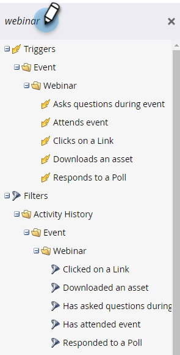

# 이벤트 워크플로 {#event-workflows}

웨비나가 완료되면 대시보드 탭으로 이동하여 집계된 성능을 확인합니다.

>[!NOTE]
>
>웨비나가 완료되지 않았거나 어떤 이유로든 데이터를 받지 않은 경우 대시보드 탭을 아직 사용할 수 없습니다.

## 수동 동기화 {#manual-sync}

대화형 웨비나를 사용하면 웨비나 완료 후 2시간 내에 웨비나를 자동으로 수신하지 않은 경우 Adobe Connect에서 웨비나의 참여 데이터를 획득할 수 있습니다. 대화형 웨비나 게재일부터 31일이 지난 후, 웨비나의 _대시보드_&#x200B;에 있는 헤더의 오른쪽에 &quot;요청 시 활동 동기화&quot; 옵션이 나타납니다. 이 아이콘을 클릭하면 Adobe Connect에서 가져오기를 트리거하여 Marketo Engage의 데이터를 채웁니다. 웨비나 날짜부터 **요청 시 활동 동기화**&#x200B;를 클릭하는 날짜까지 데이터를 동기화합니다.

## 대시보드 위젯 {#dashboard-widgets}

대시보드는 4개의 위젯으로 구성됩니다.

**이벤트 프로그램 상태**: 해당 이벤트에 대한 다양한 프로그램 상태와 현재 해당 프로그램 상태 값을 보유하고 있는 프로그램 구성원 수를 표시합니다.

**출석**: 웨비나에 참석한 다양한 구성원의 출석 기간을 전체 웨비나 기간과 비교하여 백분율로 강조 표시합니다.

**투표 성과**: Adobe Connect에서 제공하는 웨비나 중에 시작된 다양한 투표와 각 질문에 대한 투표에 참석하고 응답한 구성원의 분포를 표시합니다.

**클릭 및 파일 다운로드 활동**: 웨비나에 참석하고 해당 특정 작업을 수행한 다양한 구성원이 Adobe Connect에서 제공하는 웨비나에서 클릭한 파일 및 웹 링크의 다운로드 횟수를 제공합니다.

## 웨비나 녹화 {#webinar-recording}

개요 탭으로 이동하여 기록된 웨비나를 보고, 링크를 가져와서 공유하거나, 사본을 다운로드합니다.

>[!NOTE]
>
>* 대화형 웨비나는 자동으로 기록되지 않습니다. 웨비나가 시작되면 웨비나 이름 옆에 있는 드롭다운을 클릭하고 **세션 기록**&#x200B;을 선택합니다.
>* 세션이 기록된 경우 호스트는 수동으로 기록을 종료하거나 &quot;모든 사용자의 세션 종료&quot;를 선택하여 기록을 중지해야 합니다. 그렇지 않으면 마지막 참석자가 회의실을 떠난 후 10분 이내에 녹화가 자동으로 중지됩니다.
>* 레코딩은 MP4 형식으로 다운로드됩니다.
>* 녹화를 공유할 때는 링크가 있는 모든 사용자가 볼 수 있으므로 의도한 대상자와 공유되었는지 확인하십시오.

## 트리거 및 필터 {#triggers-and-filters}

대화형 웨비나 관련 트리거 및 필터를 사용하여 이벤트 프로그램 내에서 특정 사용자 그룹을 찾습니다.

각 트리거/필터에는 추가 제약 조건이 포함되어 있으므로 해당 그룹의 포커스가 있는 하위 집합을 캡처할 수 있습니다.

**이벤트 중 질문하기**(필터 버전: 이벤트 중 질문하기)

**이벤트에 참석함**(필터 버전: 이벤트에 참석함)

**링크 클릭**(필터 버전: 링크 클릭)

**에셋을 다운로드합니다**(필터 버전: 에셋을 다운로드함)

**투표에 응답**(필터 버전: 투표에 응답함)

