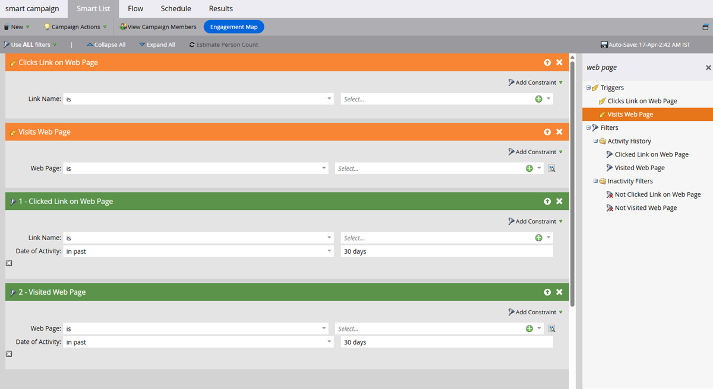

# GenAI의 특징 {#gen-ai-features}

기록된 웨비나에 대한 챕터 및 요약을 자동으로 생성하므로 대상자가 쉽게 액세스하고 탐색할 수 있습니다.

* **자동 챕터 생성**: AI 기반 기술은 웨비나 콘텐츠의 챕터를 만듭니다.

* **AI 생성 요약**: 웨비나에 대한 자동화된 텍스트 요약을 가져옵니다.

* **편집 가능한 콘텐츠**: 수동 및 AI 기반 편집 기능을 사용하여 원하는 경우 생성된 챕터 및 요약을 수정합니다.

* **간편한 통합**: 원하는 웹 페이지 편집기에 HTML 코드를 복사하여 랜딩 페이지에 챕터와 요약을 쉽게 추가할 수 있습니다.

## GenAI 활성화 {#enable-genai}

>[!PREREQUISITES]
>
>이러한 기능을 사용하기 전에 먼저 Adobe GenAI 약관에 동의해야 합니다. 아직 계정이 없는 경우 Adobe 계정 팀(계정 관리자)에 연락하여 자세한 내용을 확인하십시오.

Adobe GenAI 약관에 동의한 후 다음 단계는 개별 사용자에 대해 활성화하는 것입니다. **[!UICONTROL Admin]** > **[!UICONTROL Interactive Webinars]**(으)로 이동하여 GenAI에 액세스해야 하는 사용자를 선택하면 됩니다.

{width="800" zoomable="yes"}

## 액세스 방법 {#how-to-access}

1. Marketo Engage 대화형 웨비나의 웨비나 개요 페이지로 이동합니다.

1. 온디맨드 웨비나를 진행한 후 AI가 녹화를 처리할 때까지 30~60분 정도 기다립니다. 사용 가능한 경우 생성 버튼을 클릭할 수 있습니다.

1. **[!UICONTROL Generate]**&#x200B;을(를) 클릭합니다.

   {width="800" zoomable="yes"}

1. AI가 생성한 챕터와 텍스트 요약을 표시하는 새 탭이 열립니다.

## 생성된 콘텐츠 편집 {#edit-generated-content}

1. 생성된 챕터 및 요약을 검토합니다.

1. 변경이 필요한 경우 **[!UICONTROL Edit]** 단추를 클릭합니다.

   수정 중:

   * 요약 및/또는 챕터 제목에서 텍스트를 편집합니다.

   * 필요한 경우 타임스탬프 필드의 값을 편집하여 타임스탬프를 조정합니다.

   * 원하지 않는 챕터를 선택하고 **[!UICONTROL Delete]**&#x200B;을(를) 클릭하여 삭제합니다.

   * 두 개의 연속 챕터를 선택하고 **[!UICONTROL Merge]**&#x200B;을(를) 클릭하여 병합합니다.

      * AI는 선택한 두 개의 챕터로 구성된 복합 챕터를 생성합니다

      * 여러 챕터를 병합하려면 한 번에 두 개의 작업을 수행해야 합니다

     {width="800" zoomable="yes"}

   >[!NOTE]
   >
   >* 원하는 경우 _엄지손가락 위로_  또는 _엄지손가락 아래로_  아이콘을 사용하여 생성된 챕터/요약의 품질을 평가할 수 있습니다. 플래그 아이콘 을 클릭하여 문제가 있는 콘텐츠에 플래그를 지정할 수도 있습니다.
   >
   >* 초기 요약에 만족하지 않는 경우 **[!UICONTROL Regenerate summary]** 단추를 클릭하면 다른 버전이 생성됩니다.

1. 화면 오른쪽 상단의 **[!UICONTROL Save]** 단추를 클릭하여 변경 내용을 저장합니다.

## 생성된 콘텐츠 사용 {#use-generated-content}

사용할 콘텐츠를 복사한 후 선택한 편집기(예: Marketo Engage 랜딩 페이지 편집기)에 붙여 넣고 원하는 대로 조정합니다.

### 요약 {#summary}

**HTML 복사** - **[!UICONTROL Copy HTML]** 단추를 클릭하여 모든 텍스트를 가져오고, 테이블 내에서 HTML 코드 서식을 지정하여 완료합니다.

**텍스트만** - 텍스트만 복사하려면 텍스트를 강조 표시하고 Ctrl/Cmd+C(또는 마우스 오른쪽 단추 클릭)를 선택하여 복사하십시오.

### 챕터 {#chapters}

**HTML 복사** - **[!UICONTROL Copy HTML]** 단추를 클릭하여 비디오 플레이어에서 서식이 지정된 모든 녹음/녹화 및 해당 챕터를 가져옵니다.

## 대상을 타기팅하십시오

스마트 캠페인/목록 필터 및/또는 트리거를 활용하여 각 뷰어가 시청한 항목, 횟수 등을 확인함으로써 개인화된 후속 작업을 수행할 수 있습니다.

{width="800" zoomable="yes"}

* **트리거**: _웹 페이지에서 링크 클릭_, _웹 페이지 방문_

* **필터**: _웹 페이지에서 링크를 클릭함_, _방문한 웹 페이지_

&quot;링크&quot;는 챕터 이름이고 &quot;웹 페이지&quot;는 온디맨드 웨비나를 호스팅하는 페이지입니다.

>[!TIP]
>
>대상 대상을 세분화하려면 [제약 조건](/help/marketo/product-docs/core-marketo-concepts/smart-lists-and-static-lists/using-smart-lists/add-a-constraint-to-a-smart-list-filter.md){target="_blank"}을 사용하십시오.

## 유의할 사항 {#things-to-note}

* 챕터를 삭제하거나 병합하는 것은 챕터 스택에만 영향을 주고 비디오 콘텐츠 자체에는 영향을 주지 않습니다. 이러한 작업은 영구적입니다.

* GenAI 기능은 유연하며 Marketo Engage의 기능뿐만 아니라 다양한 웹 페이지 편집기와 함께 사용할 수 있습니다.

* 항상 변경 내용을 미리보기하여 원하는 기능과 모양을 확인하십시오.

* 웨비나를 삭제하면 GenAI 콘텐츠도 삭제됩니다.

* 웨비나를 삭제하지 않고 GenAI 콘텐츠를 삭제하려면 Adobe 계정 팀(계정 관리자)에 문의하거나 데이터 삭제 요청을 `marketo-webinar-genai-alerts@adobe.com`(으)로 보내십시오.
