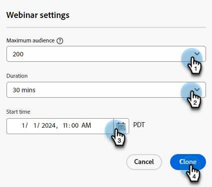

# 대화형 웨비나 수정 또는 삭제 {#modify-or-delete-an-interactive-webinar}

대화형 웨비나를 변경하는 방법을 알아봅니다.

## 대화형 웨비나 수정 {#modify-an-interactive-webinar}

1. 원하는 이벤트 프로그램을 선택하고 **룸/템플릿 변경**.

   

1. 텍스트

PICC

??? 닐에쉬의 경우 - 웨비나가 이미 있는 방으로 들어가지 않는 것이 정상입니까? 그렇지 않다면, 가장 좋은 방법은 무엇입니까?

## 대화형 웨비나 다시 예약 {#reschedule-an-interactive-webinar}

1. 원하는 이벤트 프로그램을 선택하고 현재 예약된 날짜/시간 옆에 있는 연필 아이콘을 클릭합니다.

   

1. 달력 아이콘을 클릭하고 새 날짜/시간을 선택한 다음 **저장**.

   

## 대화형 웨비나 복제 {#clone-an-interactive-webinar}

1. 원하는 이벤트 프로그램을 선택합니다.

   

1. 프로그램 작업 드롭다운을 클릭하고 을 선택합니다 **복제**.

   

   >[!TIP]
   >
   >트리에서 이벤트 프로그램을 마우스 오른쪽 단추로 클릭하고 를 선택할 수도 있습니다 **복제** 그곳으로부터.

1. 복제된 프로그램에 이름을 지정하고 Workspace 및 대상을 설정한 다음(프로그램이 다른 곳에 있도록 하려면) **저장**.

   

1. 클릭 **다음**.

   

1. 복제된 웨비나에 대한 설정을 선택하고 를 클릭합니다. **복제**.

   

## 대화형 웨비나 삭제 {#delete-an-interactive-webinar}

1. 원하는 이벤트 프로그램을 선택합니다.

   

1. 프로그램 작업 드롭다운을 클릭하고 을 선택합니다 **삭제**.

   

   >[!TIP]
   >
   >트리에서 이벤트 프로그램을 마우스 오른쪽 단추로 클릭하고 를 선택할 수도 있습니다 **삭제** 그곳으로부터.

1. 클릭 **삭제**.

   

   >[!IMPORTANT]
   >
   >프로그램에 로컬 자산이 있는 경우 해당 자산도 삭제됩니다.
