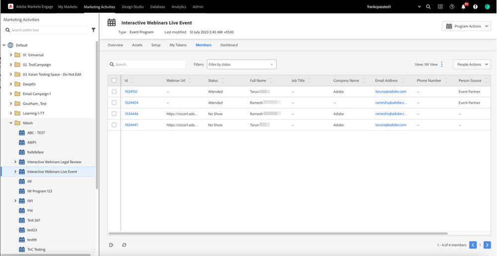

# 대화형 웨비나 홍보 {#promoting-an-interactive-webinar}

대화형 웨비나를 프로모션하는 것은 Launchpoint를 통해 파트너 웨비나를 프로모션하는 것과 비슷합니다. 대화형 웨비나 이벤트 프로그램을 만들 때 캠페인을 실행하거나 프로그램에 멤버를 가져와서 멤버를 추가할 수 있습니다. 대화형 웨비나 이벤트 프로그램에 추가된 멤버를 확인하려면 **[!UICONTROL Members]** 탭을 클릭하십시오.

## 개요 {#overview}

구성원을 추가하거나 가져온 후 대화형 웨비나 이벤트 프로그램 내에서 이메일 캠페인을 만들어 모든 프로그램 구성원에게 초대장을 보내고, 이메일이 배달되면 상태를 &quot;초대됨&quot;으로 변경할 수 있습니다.

>[!NOTE]
>
>공동 호스트 또는 발표자를 대화형 웨비나 이벤트 프로그램에 대상자 멤버로 추가하려면 다른 이메일 ID를 사용해야 합니다. 그렇지 않으면 &quot;이 이메일이 이미 등록되었습니다&quot; 오류가 표시됩니다.

이메일에는 프로그램의 특정 세부 정보를 포함할 수 있으며, 웨비나에 대한 자세한 정보(예: 컨텐츠, 발표자 정보 등)를 추가할 수 있는 특정 페이지로 수신자를 리디렉션하는 랜딩 페이지 URL을 포함할 수 있습니다. 이 랜딩 페이지는 대화형 웨비나 이벤트 프로그램에서 로컬 자산으로 만들 수 있습니다.

랜딩 페이지에서 양식을 활성화하고 양식 클릭을 대화형 웨비나 이벤트 프로그램에서 활성화된 등록에 연결하여 이 웨비나에 대한 등록을 요청할 수 있습니다. 그런 다음 양식 제출을 트리거로 사용하고 프로그램 상태를 &quot;초대됨&quot;에서 &quot;등록됨&quot;으로 변경하는 캠페인을 만들 수 있습니다.

>[!NOTE]
>
>전환을 만드는 트리거가 여러 개 있을 수 있으므로 &quot;초대됨&quot;에서 &quot;등록됨&quot;으로의 전환은 대화형 웨비나에서 자동으로 수행되지 않습니다.

구성원이 대화형 웨비나 이벤트 프로그램에서 &quot;등록됨&quot; 프로그램 상태에 있으면 Adobe Connect에서 만든 웨비나에 자동으로 등록됩니다. 그러면 이름, 성 및 이메일 ID와 같은 등록 데이터가 Adobe Connect으로 전송됩니다. 즉, 사용자가 웨비나에 참여자로 참여하면 웨비나 도중 발표자 또는 호스트가 해당 정보를 사용할 수 있습니다.

등록 후 몇 분 안에 멤버의 웨비나 URL이 [멤버] 탭에서 채워집니다. 웨비나 URL에 대한 열을 찾을 수 없는 경우 열이 보기에 추가되었는지 확인하십시오. 등록된 각 멤버가 인증 없이 예약된 시간에 웨비나에 입력할 수 있도록 개인화된 URL입니다. 내부적으로 교환되는 토큰은 회원들의 인증을 대신한다.

`{{member.webinar url}}` [token](/help/marketo/product-docs/demand-generation/landing-pages/personalizing-landing-pages/tokens-overview.md){target="_blank"}을 사용하여 전자 메일 캠페인에 개별 구성원의 웨비나 URL을 포함하여 이벤트에 등록되었음을 알리고 예약된 시간에 가입 URL을 사용하여 웨비나를 입력할 수 있습니다. 동일한 이메일 캠페인에서 달력 토큰을 사용하여 웨비나 일정을 구성원의 달력에 추가할 수 있습니다.

링크는 이벤트 프로그램의 개요 탭 오른쪽에 있어 랜딩 페이지와 이메일 캠페인을 만들 수 있습니다. 이벤트와 관련된 나머지 프로모션은 Launchpoint 통합을 사용하여 파트너 웨비나와 동일하게 유지됩니다.

대화형 웨비나를 사용하면 웨비나 전, 중, 후에 등록을 요청할 수 있습니다. 모든 경우, 웨비나 URL을 잠재 고객과 공유하면 됩니다. 웨비나가 시작되기 전에 링크를 클릭하면 웨비나 이전 랜딩 페이지로 이동합니다. 웨비나 중에 클릭하면 진행 중인 웨비나로 이동합니다. 웨비나 다음에 해당 웨비나를 클릭하면 웨비나 녹화로 이동합니다.

## 대화형 웨비나 토큰 {#interactive-webinars-tokens}

웨비나 세부 정보를 수동으로 추가하지 않고도 토큰을 사용하여 이메일에서 대화형 웨비나를 홍보할 수 있습니다. 웨비나 메타데이터(예: 웨비나 제목, 시작 날짜 등)에 대한 변경 사항이 자산에 자동으로 반영되므로 전반적인 효율성이 향상됩니다.

>[!NOTE]
>
>대화형 웨비나 토큰은 현재 랜딩 페이지에서 지원되지 않습니다.

**토큰 목록**

<table><thead>
  <tr>
    <th>토큰</th>
    <th>정의</th>
  </tr></thead>
<tbody>
  <tr>
    <td>program.webinarCapacity</td>
    <td>대화형 웨비나에 참여할 수 있는 최대 참석자 수입니다.</td>
  </tr>
  <tr>
    <td>program.webinarDuration</td>
    <td>대화형 웨비나가 예약된 기간입니다.</td>
  </tr>
  <tr>
    <td>program.webinarEndDate</td>
    <td>예약된 대화형 웨비나의 종료 날짜입니다.</td>
  </tr>
  <tr>
    <td>program.webinarEndTime</td>
    <td>대화형 웨비나의 예약된 종료 시간입니다.</td>
  </tr>
  <tr>
    <td>program.webinarGenericURL</td>
    <td>대상자 포스트 웨비나와 공유할 수 있는 일반 레코딩 URL. 이 URL은 웨비나 라이브 참석을 위한 것이 아니며 대상자의 활동을 추적하지 않습니다.</td>
  </tr>
  <tr>
    <td>program.webinarLanguage</td>
    <td>웨비나를 수행할 언어입니다.</td>
  </tr>
  <tr>
    <td>program.webinarStartDate</td>
    <td>예약된 대화형 웨비나의 시작 날짜입니다.</td>
  </tr>
  <tr>
    <td>program.webinarStartTime</td>
    <td>대화형 웨비나의 예약된 시작 시간입니다.</td>
  </tr>
  <tr>
    <td>program.webinarTimezone</td>
    <td>대화형 웨비나가 예약된 시간대입니다.</td>
  </tr>
  <tr>
    <td>program.webinarTitle</td>
    <td>웨비나 시작 Screens에서 대상자가 볼 수 있는 대화형 웨비나의 제목입니다.</td>
  </tr>
</tbody></table>
