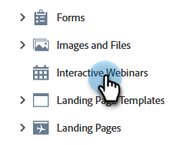
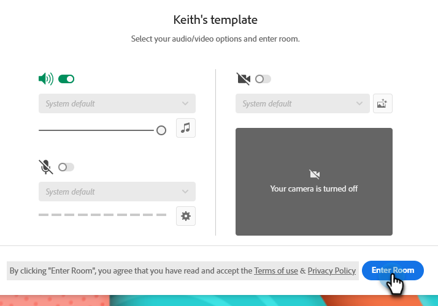

# 대화형 웨비나용 템플릿 {#templates-for-interactive-webinars}

대화형 웨비나에서 사용하기 쉬운 템플릿을 만들어 콘텐츠를 더 빨리 제작하고 팀에서 작업할 때 브랜드 지침을 준수할 수 있습니다.

## 권한 부여 {#grant-permissions}

조직의 사용자가 대화형 웨비나에 템플릿에 액세스할 수 있으려면 먼저 Marketo Engage 관리자가 원하는 역할에 액세스를 추가해야 합니다.

1. Marketo Engage에서 **[!UICONTROL Admin]**&#x200B;을 클릭합니다.

   

1. **[!UICONTROL Users & Roles]**&#x200B;을(를) 클릭한 다음 **[!UICONTROL Roles]** 탭을 클릭합니다.

   

1. 권한을 추가할 역할을 두 번 클릭합니다.

   

1. **[!UICONTROL Access Design Studio]**&#x200B;을(를) 열려면 클릭하세요.

   

1. **[!UICONTROL Access Interactive Webinars Templates]** 확인란을 선택합니다.

   

## 템플릿 만들기 {#create-a-template}

1. Marketo Engage에서 **[!UICONTROL Design Studio]**&#x200B;을 클릭합니다.

   

1. **[!UICONTROL Interactive Webinars]**&#x200B;를 클릭합니다.

   

1. **[!UICONTROL Manage Templates]**&#x200B;를 클릭합니다.

   

1. 새 탭이 열립니다. **새로 만들기를 클릭합니다**.

   

1. 표준 템플릿 탭에서 원하는 템플릿을 선택하고 **다음**&#x200B;을 클릭합니다.

   

   >[!NOTE]
   >
   >조직 템플릿은 사용자 또는 팀이 이미 만든 템플릿입니다.

1. 이름과 설명을 입력합니다. **저장 후 열기**&#x200B;를 클릭합니다.

   

1. 새 탭이 열립니다. 템플릿을 편집/저장하려면 룸을 입력해야 합니다. 실제 웨비나 룸이 아니므로 오디오/비디오를 선택할 필요가 없습니다. **회의실 입력**&#x200B;을 클릭하세요.

   

1. 기존 템플릿을 원하는 대로 변경합니다.

   

1. 오른쪽 상단의 종료 메뉴에서 **모두 세션 종료**&#x200B;를 선택합니다.

   

1. **지금 끝내기**&#x200B;를 클릭합니다.

   

템플릿이 자동으로 저장됩니다.

## 템플릿 편집 {#edit-a-template}

기존 템플릿을 편집하려면 아래 단계를 따르십시오.

1. Marketo Engage에서 **[!UICONTROL Design Studio]**&#x200B;을 클릭합니다.

   

1. **[!UICONTROL Interactive Webinars]**&#x200B;를 클릭합니다.

   

1. **[!UICONTROL Manage Templates]**&#x200B;를 클릭합니다.

   

1. 새 탭이 열립니다. 편집할 템플릿을 찾은 다음 열기 아이콘을 클릭합니다.

   

1. 새 탭이 열립니다. 템플릿을 편집하려면 룸을 입력해야 합니다. 실제 웨비나 룸이 아니므로 오디오/비디오를 선택할 필요가 없습니다. **회의실 입력**&#x200B;을 클릭하세요.

   

1. 템플릿을 원하는 대로 변경합니다.

   

1. 오른쪽 상단의 종료 메뉴에서 **모두 세션 종료**&#x200B;를 선택합니다.

   

1. **지금 끝내기**&#x200B;를 클릭합니다.

   

변경 사항이 자동으로 저장됩니다.
