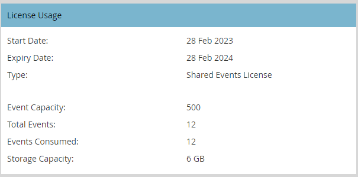

# 사용자 및 라이선스 관리 {#user-and-license-management}

사용자를 추가 및 제거하고 현재 라이선스를 보는 방법에 대해 알아봅니다.

## 사용자 추가 {#add-a-user}

1. 로 이동 **관리자** 영역입니다.

   

1. 클릭 **대화형 웨비나**.

   

1. 클릭 **사용자 추가/제거**.

   

1. 사용 가능한 사용자 드롭다운을 클릭하고, 추가하려는 사용자를 선택한 다음 를 클릭합니다. **확인**.

   

## 사용자 제거 {#remove-a-user}

1. 로 이동 **관리자** 영역입니다.

   

1. 클릭 **대화형 웨비나**.

   

1. 클릭 **사용자 추가/제거**.

   

1. 제거할 사용자를 강조 표시하고 키보드에서 Delete 키를 누릅니다. 클릭 **확인** 완료 시.

   

## 라이선스 사용 {#license-usage}

대화형 웨비나는 Adobe Connect에서 제공하는 이벤트를 만들기 위한 특정 라이선스를 제공합니다. 라이센스가 추가될 때마다 새 라이센스 사용 상자가 나타납니다. Marketo 관리자는 아래 단계에 따라 라이센스를 볼 수 있습니다(편집할 수 없음). 추가 라이선스를 얻으려면 Adobe 계정 팀(계정 관리자)에 문의하십시오.

1. 로 이동 **관리자** 영역입니다.

   

1. 클릭 **대화형 웨비나**.

   

1. 라이센스 사용 카드로 스크롤합니다.

   

<table> 
  <tr>
   <td width="20%"><b>시작 일자</b></td>
   <td width="80%">라이센스 시작 날짜.</td>
  </tr>
  <tr> 
   <td width="20%"><b>만료일</b></td>
   <td width="80%">라이센스가 만료되는 날짜입니다.</td>
  </tr>
  <tr> 
   <td width="20%"><b>유형</b></td>
   <td width="80%">구매한 라이선스 유형. 사용 가능한 유형은 공유 이벤트 라이선스, 공유 룸 라이선스, 추가 저장소 라이선스 세 가지입니다.</td>
  </tr>
  <tr> 
   <td width="20%"><b>이벤트 용량</b></td>
   <td width="80%">이벤트에 수용할 수 있는 최대 참가자 수입니다.</td>
  </tr>
  <tr> 
   <td width="20%"><b>총 이벤트 수</b></td>
   <td width="80%">이 라이선스로 프로비저닝된 총 이벤트 수입니다.</td>
  </tr>
  <tr> 
   <td width="20%"><b>사용된 이벤트</b></td>
   <td width="80%">완료된 총 이벤트 수입니다.</td>
  </tr>
  <tr> 
   <td width="20%"><b>스토리지 용량</b></td>
   <td width="80%">기록, 자료, hero images, 문서 및 기타 자산을 저장하는 데 사용할 수 있는 스토리지 용량입니다.</td>
  </tr>
  </tbody>
</table>

**참고할 사항**

* &quot;추가 스토리지 라이센스&quot; 유형은 스토리지를 제공하므로 모든 필드의 값이 _외에_ 스토리지 용량은 단순히 &quot;-&quot;로 표시됩니다.

* &quot;Shared Room License&quot; 유형은 무제한 이벤트를 포함하며 &quot;Additional Storage License&quot;는 스토리지를 제공하므로 이러한 라이센스의 총 이벤트 필드는 간단히 &quot;-&quot;로 표시됩니다.

* 이벤트가 생성될 때마다 해당 라이선스에서 &quot;소비됨&quot;으로 계산됩니다(Shared Room 라이선스가 아닌 경우). 동일한 용량의 &quot;공유 이벤트 라이선스&quot;와 &quot;공유 룸 라이선스&quot;가 모두 있는 경우 &quot;공유 이벤트 라이선스&quot;에 대한 기본 설정이 제공됩니다. 이벤트가 게재되지 않았고 예약된 시간 전에 이벤트 프로그램 이 삭제되면 소비된 이벤트에서 이벤트를 빼서 이벤트 수를 보충합니다.

* 라이선스가 소진되면 해당 타일은 관리 섹션의 대화형 웨비나 화면에 유지되며 &quot;총 이벤트 수&quot; 및 &quot;사용된 이벤트 수&quot;는 동일한 값을 갖습니다. 라이선스가 만료될 때만 화면에서 제거됩니다.

## 사용자 액세스 {#user-access}

대화형 웨비나에는 대화형 웨비나를 만들고 게재할 수 있는 권한을 Marketo Engage 사용자에게 부여하여 사용을 규제하는 기능이 있습니다. 그러나 대화형 웨비나 사용자(또는 사용자가 아닌 사용자)는 다른 사용자가 만든 대화형 웨비나 이벤트 프로그램에 대한 읽기/편집 액세스 권한을 계속 가질 수 있습니다.

대화형 웨비나 권한이 부여되고 특정 대화형 웨비나 이벤트 프로그램의 소유자인 Marketo 사용자는 해당 프로그램과 관련된 모든 대화형 웨비나 기능을 수행할 수 있습니다. 여기에는 해당 프로그램 생성, 액세스, 수정, 복제, 이동 및 삭제가 포함됩니다. 그러나 해당 사용자가 더 이상 대화형 웨비나 사용자가 아닌 경우 프로그램 소유자는 프로그램에 액세스하고 프로그램을 이동할 수 있지만 다른 기능은 수행할 수 없습니다.

대화형 웨비나 권한이 부여되고 다음과 같은 Marketo 사용자 _아님_ 특정 대화형 웨비나 이벤트 프로그램의 소유자는 해당 프로그램에서 제한된 기능을 수행할 수 있습니다. 관리자가 아닌 Marketo 사용자는 프로그램에 액세스하고 복제할 수 있지만 대화형 웨비나에 대한 권한이 있는 경우 다른 기능을 수행할 수 없습니다. 단, Marketo 관리자 사용자 _의지_ 해당 프로그램에 액세스, 수정, 복제, 이동 및 삭제와 같은 모든 기능을 수행할 수 있습니다(Interactive Webinars에 대한 권한이 있는 한). Marketo 관리자 및 관리자가 아닌 사용자에 대해 이 권한이 취소되면 대화형 웨비나 이벤트 프로그램에만 액세스할 수 있고 다른 기능은 수행할 수 없습니다.

실행 가능한 기능의 제한은 회색으로 표시된 작업 버튼과 마우스로 가리키면 표시됩니다. 회색으로 표시된 작업 버튼의 몇 가지 예는 &quot;웨비나 디자인&quot; 또는 &quot;웨비나 입력&quot;입니다. 실행 불가능한 기능의 경우 제한 사항을 강조 표시하는 메시지가 제공됩니다. 아래 예를 참조하십시오.

