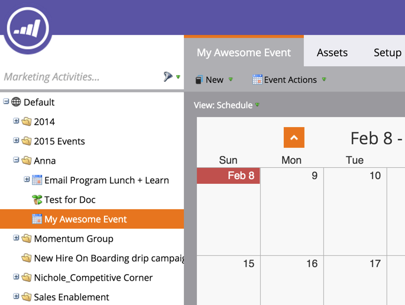

# 새 이벤트 프로그램 만들기 {#create-a-new-event-program}

이벤트를 사용하면 온라인 및 오프라인 이벤트를 자동화할 수 있습니다. 다양한 단계를 거쳐 진행 중인 고객의 상태를 파악하고 마케팅 이니셔티브에 대한 ROI를 정확하게 측정할 수 있습니다.

1. 이동 **마케팅 활동**.

   

1. 새 프로그램의 폴더를 선택합니다. 선택 **새로 만들기** 을(를) 클릭합니다. **새 프로그램**.

   

1. 이벤트의 이름을 선택합니다. 그런 다음 **프로그램 유형**, 선택 **이벤트**.

   

1. 선택 **채널**.

   >[!NOTE]
   >
   >채널은 프로그램에서 사용자가 가질 수 있는 다양한 상태를 정의합니다. 추가 정보 [프로그램 멤버십](/help/marketo/product-docs/core-marketo-concepts/programs/creating-programs/understanding-program-membership.md) 여기 있습니다.

   

1. Click **Create**.

   

   타! 이제 새 이벤트가 트리에 나타납니다.

   

1. 이벤트를 예약하려면 을(를) 선택합니다. **예약 보기** 일정에서 클릭하여 팝업을 엽니다. 날짜 및 시간을 입력합니다.

   

1. 막대를 밀어서 **확인됨** 다 되면

   

이벤트가 만들어지면 [랜딩 페이지](/help/marketo/product-docs/demand-generation/landing-pages/free-form-landing-pages/create-a-free-form-landing-page.md), [forms](/help/marketo/product-docs/demand-generation/forms/creating-a-form/create-a-form.md), 및 [이메일](/help/marketo/product-docs/email-marketing/email-programs/creating-an-email-program/create-an-email-program.md) 손님을 초대합니다! 또한 [프로그램 스케줄 보기](https://docs.marketo.com/display/docs/program+schedule+view).

>[!MORELIKETHIS]
>
>* [마케팅 달력](/help/marketo/product-docs/core-marketo-concepts/marketing-calendar/understanding-the-calendar/navigating-the-marketing-calendar.md)
>* [프로그램에서 기간 원가 사용](/help/marketo/product-docs/core-marketo-concepts/programs/working-with-programs/using-period-costs-in-a-program.md)

