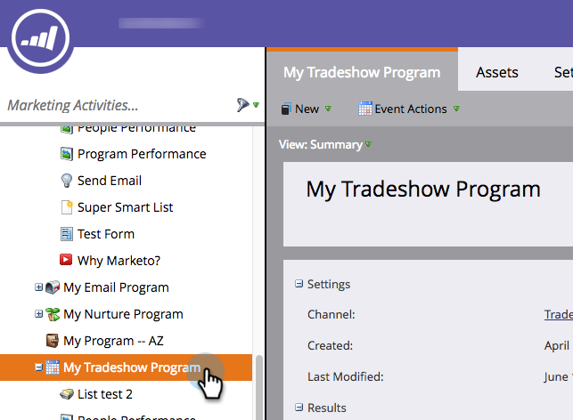

# 이벤트 채널 편집 {#edit-an-event-channel}

이벤트의 **요약** 탭 또는 **설정** 탭.

>[!NOTE]
>
>이 옵션은 연결된 구성원이 없는 이벤트에만 사용할 수 있습니다. 이벤트에 멤버가 있으면 채널 유형을 변경할 수 없습니다.

>[!NOTE]
>
>프로그램은 특정 마케팅 이니셔티브입니다. 다음 **channel** 는 Webinar, Tradeshow 또는 Online Ad와 같은 게재 메커니즘으로 사용됩니다. 자체 인스턴스에서 사용할 수 있는 항목에 따라 드롭다운에 다른 채널 옵션이 표시될 수 있습니다. 다음을 수행할 수도 있습니다  [고유한 채널 만들기](/help/marketo/product-docs/administration/tags/create-a-program-channel.md).

## 요약 탭에서 {#from-the-summary-tab}

1. From **마케팅 활동**&#x200B;트리에서 이벤트를 선택합니다.

   

1. 로 이동합니다 **요약** 보기.

   

1. 아래에 **설정** 카테고리에서 현재 **채널** 하이퍼링크로 표시됩니다.

   

1. 드롭다운 목록에서 새 채널을 선택합니다.

   

1. 클릭 **저장**.

   

## 설정 탭에서 {#from-the-setup-tab}

이벤트의 **설정** 탭.

1. 트리에서 이벤트를 선택합니다.

   

1. 로 이동합니다 **설정** 탭. 현재 **채널**.

   

1. 새 항목 선택 **채널**.

   

1. 클릭 **저장**.

   

축하합니다! 방금 채널을 편집했습니다!
