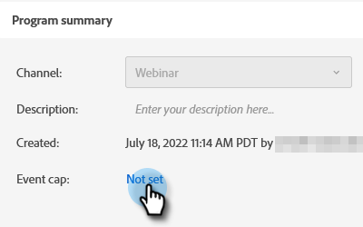

# 이벤트 상한 설정 {#setting-an-event-cap}

이벤트 상한으로 이벤트에 등록할 수 있는 사람의 수를 제한합니다.

>[!NOTE]
>
>모든 사용자가 이 기능을 구입한 것은 아닙니다. 자세한 내용은 Adobe 계정 팀(계정 관리자)에 문의하십시오.

>[!IMPORTANT]
>이벤트 상한을 설정하려면 먼저 프로그램에 승인된 랜딩 페이지(등록 페이지 및 등록 전체 페이지)가 두 개 이상 있어야 합니다.

>[!NOTE]
>
>이벤트에서 공간을 확보하려면 프로그램 구성원을 제거해야 합니다(해당 상태를 &quot;프로그램에 없음&quot;으로 업데이트하여 제거할 수 있음).

1. 이벤트 프로그램을 선택합니다.

   

1. 개요에서 [!UICONTROL Event Cap]을(를) 찾아 **[!UICONTROL Not Set]**&#x200B;을(를) 클릭합니다.

   

1. 이벤트에 등록할 수 있는 최대 인원을 입력하고 **[!UICONTROL Next]**&#x200B;을(를) 클릭합니다.

   

1. [!UICONTROL Registration Page(s)] 드롭다운을 클릭하고 등록 페이지로 사용할 랜딩 페이지를 선택합니다.

   

1. **[!UICONTROL Registration Full Page]** 드롭다운을 클릭하고 등록 전체 페이지로 사용할 랜딩 페이지를 선택합니다. 완료되면 **[!UICONTROL Set and Enable]**&#x200B;을(를) 클릭합니다.

   

   준비가 완료되었습니다. 이벤트 상한 세부 정보를 편집하려면 [!UICONTROL Event Cap] 옆에 있는 파란색 텍스트를 클릭하십시오.

   
