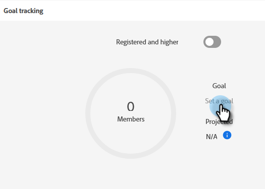

# 이벤트 목표 설정 {#setting-event-goals}

이벤트에 특정 목표를 지정하고 이들이 수행하는 성과를 확인합니다.

>[!IMPORTANT]
>
>모든 사용자가 이 기능을 구입한 것은 아닙니다. 자세한 내용은 Adobe 계정 팀(계정 관리자)에 문의하십시오.

1. 이벤트 프로그램을 만듭니다.

   

1. [!UICONTROL Campaign Folder]을(를) 선택하고, 이벤트에 [!UICONTROL Name]을(를) 지정한 다음, [!UICONTROL Program Type] 및 [!UICONTROL Channel]을(를) 선택하십시오. 완료되면 **[!UICONTROL Create]**&#x200B;를 클릭합니다.

   

1. 이벤트에서 **[!UICONTROL Reports]** 탭을 클릭합니다.

   

1. **[!UICONTROL Set a goal]**&#x200B;을(를) 클릭하여 [!UICONTROL Registered]의 목표를 입력하십시오. 에 숫자를 입력하고 enter 키를 누릅니다.

   

   

1. [!UICONTROL Attended]에 대해 동일한 단계를 반복합니다.

   

>[!NOTE]
>
>이벤트가 시작된 후에는 이벤트에 대한 목표를 설정할 수 없습니다.

[!UICONTROL Reports] 탭을 클릭하여 이벤트 목표 상태를 확인합니다.
