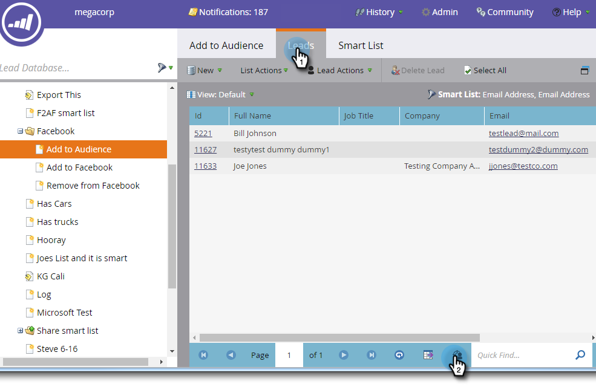

# [!DNL Facebook]에 사용자 지정 대상자에 리드 추가 {#add-leads-to-a-custom-audience-in-facebook}

[!DNL Facebook]에 이미 사용자 지정 대상이 있으며 여기에 더 많은 리드를 추가하시겠습니까? 방법은 다음과 같습니다.

>[!PREREQUISITES]
>
>* [사용자 지정 대상 만들기 [!DNL Facebook]](/help/marketo/product-docs/demand-generation/facebook/create-a-custom-audience-in-facebook.md)
>* [ 계정 내에서  [!DNL Facebook]사용자 지정 대상자 약관](https://www.facebook.com/ads/manage/customaudiences/tos.php)에 동의[!DNL Facebook]합니다.
>

1. 추가할 잠재 고객이 포함된 스마트 또는 정적 목록을 찾아 선택합니다.

   

1. **[!UICONTROL Leads]** 탭을 선택한 다음 하단의 **광고 Bridge을 통해 보내기** 아이콘을 클릭합니다.

   

1. **[!UICONTROL Facebook]**&#x200B;을(를) 선택하고 **[!UICONTROL Next]**&#x200B;을(를) 클릭합니다.

   

1. **[!UICONTROL Audience]** 드롭다운을 클릭하고 리드를 추가할 대상을 선택한 다음 **[!UICONTROL Update]**&#x200B;을(를) 클릭합니다.

   

   >[!NOTE]
   >
   >**[!UICONTROL Add leads to audience]**: 사용자 지정 하위 형식의 대상만 [!DNL Facebook]개 사용할 수 있습니다.\
   >**[!UICONTROL Remove leads from audience]**: [!DNL Facebook] 대상에서 정적 또는 스마트 목록의 리드를 제거합니다.

1. 완료되면 상태가 업데이트됩니다.

   

   이게 전부입니다!

   >[!NOTE]
   >
   >[사용자 지정 대상 만들기 [!DNL Facebook]](/help/marketo/product-docs/demand-generation/facebook/create-a-custom-audience-in-facebook.md)
