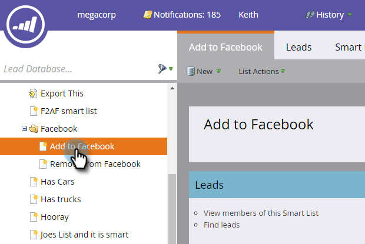
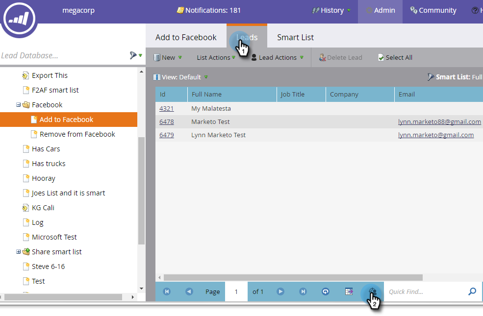

# Facebook {#create-a-custom-audience-in-facebook}에서 사용자 지정 대상자 만들기

>[!PREREQUISITES]
>
>* [관리 섹션에서 Facebook 사용자 지정 대상을 ](../../../product-docs/demand-generation/ad-network-integrations/add-facebook-custom-audiences-as-a-launchpoint-service.md) LaunchPoint 서비스로 추가합니다.
>* [Facebook 계정 내에서 Facebook의 사용자 지정 ](https://www.facebook.com/ads/manage/customaudiences/tos.php) 대상자 약관을 수락합니다.

>

>[!TIP]
>
>Facebook[의 사용자 지정 대상에 대해 자세히 알아보십시오.](https://www.facebook.com/help/341425252616329)

1. 대상을 만들 리드가 포함된 스마트 또는 정적 목록을 찾아 선택합니다.

   

1. **리드** 탭을 선택한 다음 맨 아래에 있는 **광고 브리지를 통해 전송 ** 아이콘을 클릭합니다.

   

1. **Facebook **을 선택하고 **다음**&#x200B;을 클릭합니다.

   

1. **대상** 드롭다운을 클릭하고 **+ 새 대상**&#x200B;을 선택합니다.

   

1. **대상자 이름**&#x200B;을 입력합니다. **업데이트**&#x200B;를 클릭합니다.

   

   >[!NOTE]
   >
   >Facebook 광고 계정이 여러 개 있는 경우 추가 드롭다운이 대상자를 만들 광고 계정을 선택할 수 있습니다.

   >[!TIP]
   >
   >새 대상을 현재 광고 세트 또는 그룹과 연관된 기존 대상으로 바꾸시겠습니까? **기존 대상 바꾸기** 확인란을 선택합니다. 이 작업을 수행하면 **이(가) 교체 중인 대상을 삭제하지 않습니다.**

1. 완료되면 상태 대화 상자가 업데이트됩니다.

   

   바로 그거야! Facebook에서는 **광고 관리자 > 대상**&#x200B;에 새 대상이 표시됩니다.

   

   >[!NOTE]
   >
   >Facebook에 푸시하는 모든 목록은 정적인 요소가 됩니다. Marketing의 스마트 목록은 전송 후 수행된 변경 사항을 반영하도록 Facebook의 대상 목록을 자동으로 업데이트하지 않습니다.

   >[!TIP]
   >
   >[마케팅 고객을 위한 Facebook 학습 경로](https://facebook.exceedlms.com/student/enrollments/create_enrollment_from_token/BF9TqSaCvM73PP4ScjhCm4fi)를 참조하십시오. Facebook 페이지 작성에서부터 Marketing의 광고 네트워크 통합을 사용한 Facebook 광고 타겟팅까지 알아야 할 모든 것을 다룹니다.

   >[!NOTE]
   >
   >**관련 문서**
   >
   >    
   >    
   >    * [Facebook에서 사용자 지정 대상자에 리드 추가](add-leads-to-a-custom-audience-in-facebook.md)

