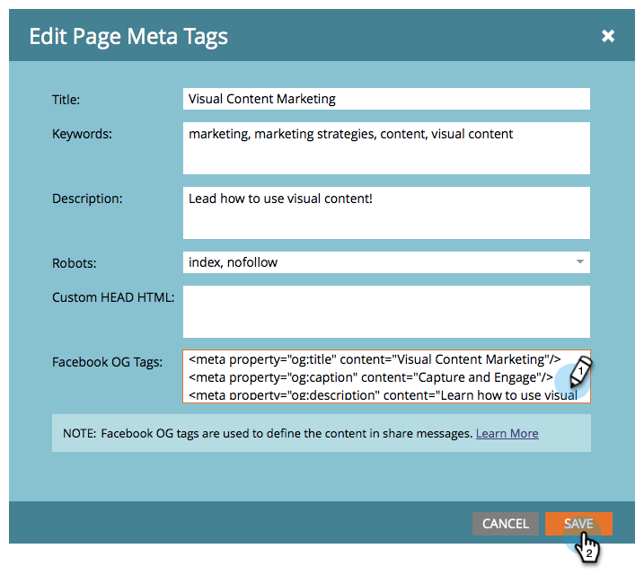

# Facebook 리치 게시물 설정 편집 {#edit-facebook-rich-post-settings}

[다른 사람이 Facebook에서 ](http://docs.marketo.com/display/docs/social)님을 공유할 때 게시물을 사용자 정의합니다.

>[!NOTE]
>
>**가용성**
>
>모든 고객이 이 기능을 구입하지는 않았습니다. 자세한 내용은 영업 담당자에게 문의하십시오.

Marketing To [소셜 앱](http://docs.marketo.com/display/docs/social)을 사용하면 리드가 랜딩 페이지를 Facebook, Twitter 등과 같은 소셜 네트워크의 연결과 공유할 수 있습니다. Facebook OpenGraph 태그(OG 태그)를 사용하면 랜딩 페이지에서 Facebook 게시물에 포함된 정보를 지정할 수 있습니다.

## 리치 게시물 옵션 {#select-rich-post-options} 선택

랜딩 페이지에서 공유로 생성된 Facebook 리치 게시물에 사용할 페이지 정보 유형을 지정할 수 있습니다.

1. **YouTube** 비디오 또는 소셜 단추의 편집기에서 **Facebook 메시지**&#x200B;를 선택합니다.

   

1. Facebook 메시지에 대해 다음 옵션 중에서 선택합니다.

   * 정적 컨텐츠 추가:제목, 캡션 및 설명을 수동으로 입력하려면 이 옵션을 선택합니다.

      

   * 동적 컨텐츠 추가:소셜 앱은 랜딩 페이지의 `<TITLE>`, `<CAPTION>` 및 `<DESCRIPTION>` 태그를 사용하여 리치 게시물을 채울 수 있습니다.

      
   >[!NOTE]
   >
   >이러한 태그는 페이지 소스에 이미 있어야 하지만, 더 잘 제어하려면 [랜딩 페이지](edit-facebook-rich-post-settings.md)에 특정 Facebook OG 태그를 추가할 수 있습니다.

   * 풍부한 컨텐츠를 추가하지 마십시오.랜딩 페이지에서 Facebook 게시물을 기본 메시지와 링크로만 제한합니다.

      

## 랜딩 페이지에 Facebook OG 태그 추가 {#add-facebook-og-tags-to-a-landing-page}

랜딩 페이지에서 Facebook 공유에 포함할 페이지 요소를 제어하기 위해 랜딩 페이지에 제목, 캡션 및 설명에 대한 Facebook OG(Open Graph) 태그를 추가할 수 있습니다.

1. **YouTube 비디오** 또는 소셜 단추가 포함된 랜딩 페이지를 엽니다.

   

   **랜딩 페이지 디자이너**&#x200B;가 새 창에서 열립니다.

1. **랜딩 페이지 작업** > **페이지 메타 태그 편집****.**

   

1. og:title, og:caption 및 og:description을 정의하는 HTML을 추가합니다. 다음 줄을 복사하여 붙여 넣고 자리 표시자 텍스트를 바꿉니다.

   `<meta property="og:title" content="My Post Title"/>`

   `<meta property="og:caption" content="My Post Caption"/>`

   `<meta property="og:description" content="This text appears in the post description"/>`

   

>[!NOTE]
>
>OG 태그를 추가할 때는 적절한 HTML 구문을 사용해야 합니다.
