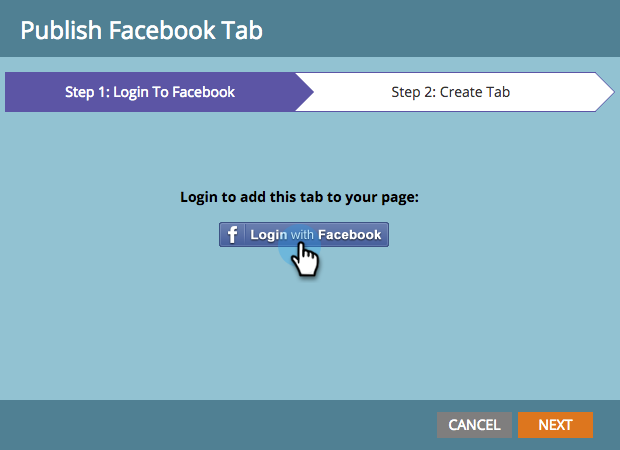

# Facebook에 랜딩 페이지 게시 {#publish-landing-pages-to-facebook}

랜딩 페이지를 Facebook에 게시하고, 기존 사용자와 만나면서 프로그램에 더 많은 트래픽을 생성할 수 있습니다.

>[!NOTE]
>
>**가용성**
>
>SMB Spark, Standard 및 Select 별도의 라이선스 기능이 포함된 엔터프라이즈

>[!PREREQUISITES]
>
>Facebook에 게시하려면 페이지에 좋아요가 2,000개 이상 있어야 합니다.

새로운 책을 출판하는 경우 이메일 및 웹 사이트를 통해 고객에게 도달할 수 있습니다. Facebook 브랜드 페이지에 Marketing to 랜딩 페이지를 추가로 게시하면 더 많은 사용자가 해당 오퍼를 공유할 수 있습니다.

1. 승인된 랜딩 페이지를 선택합니다.

   

1. 랜딩 **페이지** 작업에서 Facebook에 게시를 선택합니다.

   

   >[!NOTE]
   >
   >이 기술은 랜딩 페이지를 Facebook 앱(이전의 Facebook 탭)에 게시합니다. Facebook 앱은 모바일에서 사용할 수 없으므로 방문자가 모바일 장치의 Facebook 앱에 게시된 랜딩 페이지에 액세스하려고 하면 이 기술은 작동하지 않습니다.

1. Facebook 페이지에 게시하도록 마케팅을 승인합니다.

   

1. Facebook 자격 증명을 입력합니다.

   

   >[!NOTE]
   >
   >Marketing to 랜딩 페이지를 게시하려는 Facebook 페이지에 대한 관리자 권한이 있는 계정을 사용해야 합니다.

1. 랜딩 페이지를 게시할 **Facebook** 페이지를 선택하고 Marketing To 랜딩 페이지가 표시될 이름을 입력합니다.

   

   >[!NOTE]
   >
   >이전에 Facebook에 게시한 Marketing To 랜딩 페이지를 **바꾸려면 기존 탭** 바꾸기를 선택하고 드롭다운 목록에서 바꿀 탭을 선택합니다. 이렇게 하면 비마케팅 탭이 대체되지 않습니다.

1. 이제 리드가 Facebook 페이지에서 바로 랜딩 페이지를 방문할 수 있습니다. 표지 이미지 아래에 있는 탭 이름을 클릭하면 됩니다.

   

   >[!NOTE]
   >
   >**미리 알림**
   >
   >
   >Facebook에서 랜딩 페이지를 제거하려면 Marketing To에서 승인을 취소하고 메시지가 표시되면 Facebook 탭을 제거하는 옵션을 선택합니다.

