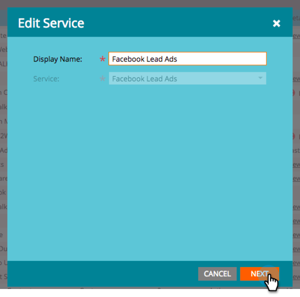

# 사용자 지정 필드를 Marketing에 매핑 {#map-custom-fields-to-marketo}

귀하는 다른 사람이 귀하의 온라인 배달 서비스를 얼마나 자주 사용하는지와 같이, 기본적으로 Facebook의 일반 정보보다 더 많은 정보를 수집할 수 있습니다. Facebook 리드 광고에 사용자 지정 질문 [을 만들어](https://www.facebook.com/business/help/774623835981457?helpref=uf_permalink) 이를 수행할 수 있습니다.

그러나 **Marketing에서 이 데이터를 자동으로 수집하지는 않습니다**.** **Marketing에서 사용자 지정 필드 값을 캡처하려면 해당 사용자 지정 필드를 Marketing의 필드에 매핑해야 **** 합니다.

다음은 관리자의 LaunchPoint 영역에서 설정하는 방법입니다.

>[!NOTE]
>
>**관리자 권한 필요**

1. 관리 영역으로 이동하여 LaunchPoint를 **클릭합니다**. 설치된 서비스에서 **Facebook 리드 광고를 찾아 편집합니다**.

   

1. 다음을 **클릭합니다**.

   

1. 승인된 계정을 그대로 둡니다. 변경하지 **마십시오** . 다음을 **클릭합니다**.

   

1. 선택한 페이지를 그대로 두십시오. 변경하지 **마십시오** . 다음을 **클릭합니다**.

   

1. 사용자 지정 Facebook 필드를 마케팅 필드에 매핑하는 곳입니다. 추가를 **클릭합니다.**

   ** 

   **

1. 새 행에 Facebook 사용자 지정 필드의 이름을 입력합니다.

   

   >[!NOTE]
   >
   >Facebook 양식 템플릿에 저장된 필드만 옵션으로 표시됩니다.

1. 마케팅 필드 **열을** 클릭합니다. 매핑할 필드를 검색하려면 입력합니다. 필드를 선택하고 나면 저장을 **클릭합니다**.

   

   >[!NOTE]
   >
   >Marketing Cloud에 Facebook 필드를 매핑하기 위한 필드가 아직 없으면 사용자 지정 필드를 [만드는 방법을 알아봅니다](../../../../product-docs/administration/field-management/create-a-custom-field-in-marketo.md).

>[!CAUTION]
>
>마케터가 데이터를 수집하려면 새로운 Facebook 필드에 대해 이 프로세스를 **수행해야** 합니다.

