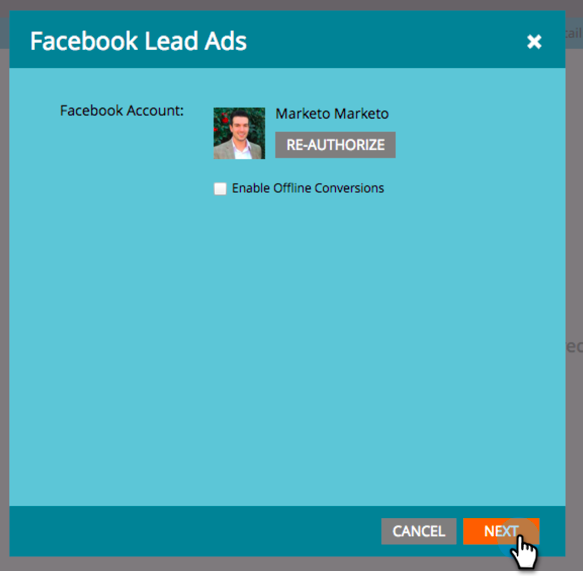

# Marketo에 사용자 정의 필드 매핑 {#map-custom-fields-to-marketo}

누군가 온라인 게재 서비스를 사용하는 빈도와 같이 기본적으로 Facebook에서 저장하는 표준 정보보다 더 많은 정보를 수집할 수 있습니다. 다음을 통해 이 작업을 수행할 수 있습니다. [사용자 정의 질문 만들기](https://www.facebook.com/business/help/774623835981457?helpref=uf_permalink) facebook 리드 광고에서.

그러나 **Marketo은 이 데이터 수집을 자동으로 시작하지 않습니다.**. Marketo에서 사용자 정의 필드 값 캡처를 시작하려면 다음을 수행합니다 **필수** 이러한 사용자 정의 필드를 Marketo의 필드에 매핑합니다.

다음은 관리자의 LaunchPoint 영역에서 설정하는 방법입니다.

>[!NOTE]
>
>**관리자 권한 필요**

1. 관리 영역으로 이동하여 **시작 지점**. 설치된 서비스에서 를 찾아 편집합니다 **Facebook 리드 광고**.

   

1. 클릭 **다음**.

   

1. 승인된 계정을 그대로 둡니다. 다음을 수행합니다 **아님** 원하는 대로 변경합니다. 클릭 **다음**.

   

1. 이전과 같이 선택한 페이지를 그대로 둡니다. **아님** 원하는 대로 변경합니다. 클릭 **다음**.

   

1. 사용자 지정 Facebook 필드를 Marketo 필드에 매핑하는 위치는 다음과 같습니다. 클릭 **추가.**

   

1. 새 행에서 Facebook 사용자 정의 필드의 이름을 입력합니다.

   

   >[!NOTE]
   >
   >facebook 양식 템플릿에 저장된 필드만 여기에 옵션으로 표시됩니다.

1. 을(를) 클릭합니다. **Marketo 필드** 열. 매핑할 필드를 검색하려면 을(를) 입력합니다. 필드를 선택한 후 **저장**.

   

   >[!NOTE]
   >
   >Marketo에 Facebook 필드를 매핑할 수 있는 필드가 없는 경우 방법 알아보기 [사용자 정의 필드 만들기](/help/marketo/product-docs/administration/field-management/create-a-custom-field-in-marketo.md).

>[!CAUTION]
>
>본인 **필수** Marketo에서 데이터를 수집하려면 새 Facebook 필드에 대해 이 프로세스를 수행하십시오.
