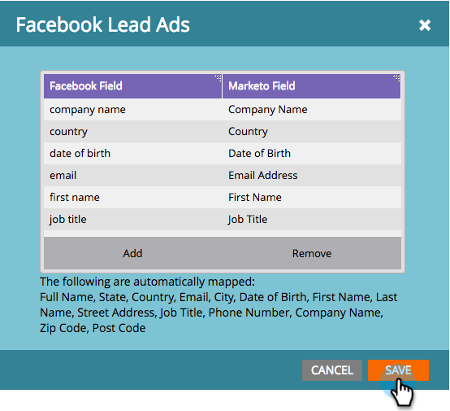

# Facebook 오프라인 전환 설정 {#set-up-facebook-offline-conversions}

광고 팀은 리드 광고를 통해 만든 사람들을 위해 오프라인 전환 데이터를 Facebook으로 다시 전송함으로써 광고 지출을 보다 효과적으로 최적화할 수 있습니다. 설정 방법

>[!PREREQUISITES]
>
>* Facebook [리드 광고를 설정해야 합니다](set-up-facebook-lead-ads.md).
>* 매출 주기 모델러에 승인된 모델이 [있어야 합니다](http://docs.marketo.com/display/docs/revenue+cycle+models).

>

## 관리 구성 {#admin-configuration}

1. Marketing To **관리자로 이동합니다**.

   

1. LaunchPoint **로** 이동하고 이전에 만든 Facebook 리드 광고 서비스를 두 번 클릭합니다.

   >[!NOTE]
   >
   >그렇지 않은 경우 먼저 Facebook 리드 광고 [설정을](set-up-facebook-lead-ads.md)선택한 다음 다시 방문하십시오.

   

1. 원하는 경우 **표시 이름을** 편집하여 오프라인 전환을 포함시킵니다. 다음을 **클릭합니다**.

   

1. 오프라인 **전환 활성화를** 선택하고 **다음을 클릭합니다**.

   

1. 다음을 **클릭합니다**.

   

1. 저장을 **클릭합니다**.

   

   달콤해 Facebook 오프라인 전환 활성화의 중간 단계입니다. 단계를 매핑하기 위해 Revenue Cycle Modeler로 이동합니다.

   

## 매출 주기 모델 구성 {#revenue-cycle-modeler-configuration}

1. Analytics로 **이동합니다**.

   

1. 모델을 선택하고 초안 **편집을 클릭합니다**.

   

   >[!NOTE]
   >
   >현재, 매출 주기 단계를 매핑할 수 있는 Facebook 이벤트가 10개 있습니다.
   >
   >    
   >    
   >    * 지불 정보 추가
   >    * 장바구니에 추가
   >    * 위시리스트에 추가
   >    * 등록 완료
   >    * 체크아웃 시작
   >    * 사용자
   >    * 기타
   >    * 구매
   >    * 검색
   >    * 콘텐츠 보기

1. 매핑할 단계를 선택한 다음 **Facebook 전환** 드롭다운에서 매핑할 Facebook 이벤트를 선택합니다. Facebook에서 RCM의 모든 단계를 오프라인 전환 단계에 매핑하려면 이 단계를 반복합니다.

   

1. 매핑을 마치면 모델을 닫습니다.

   

1. 모델을 승인하면 완료됩니다.

   

   이제 리드 광고가 매핑된 단계에 도달하면 전환을 Facebook으로 보내 보고를 받습니다.

   >[!CAUTION]
   >
   >Facebook 계정을 확인하고 모든 [광고가 마케팅 대 오프라인 전환 이벤트 세트에 연결되어](https://www.facebook.com/business/url/?href=%2Fbusiness%2Fhelp%2Fwww%2F1776828022605281&amp;cmsid&amp;creative=link&amp;creative_detail=advertiser-help-center&amp;create_type&amp;destination_cms_id&amp;orig_http_referrer) 있는지 확인합니다. 그렇지 않은 경우 광고 속성이 작동하지 않을 수 있습니다.

   >[!NOTE]
   >
   >오프라인 전환 데이터는 Marketing에서 Facebook으로 매일 여러 번 전송됩니다.

>[!NOTE]
>
>**관련 문서**
>
>* [Facebook 오프라인 전환 이해](understanding-facebook-offline-conversions.md)

>

