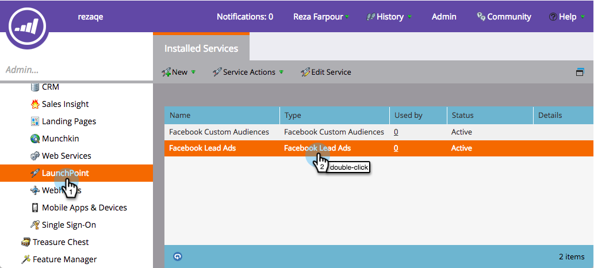
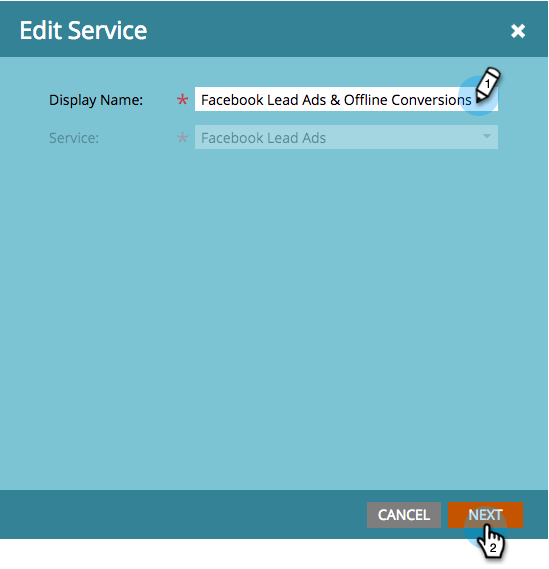
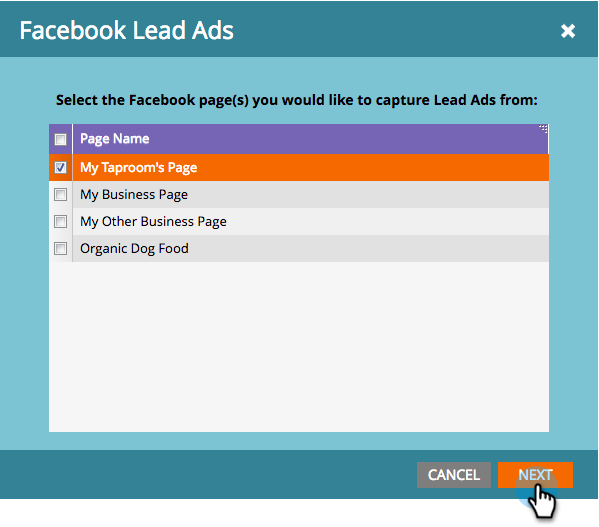
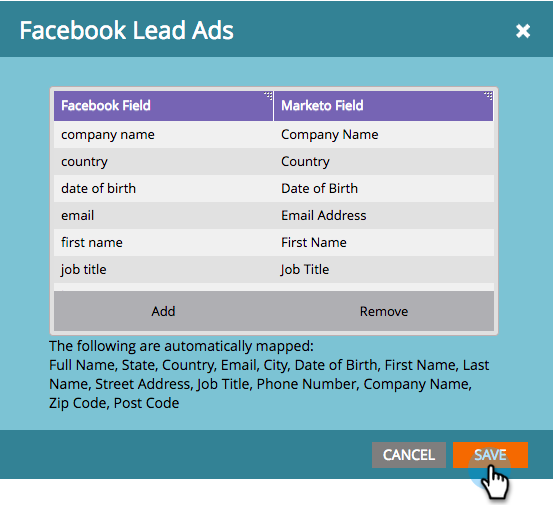
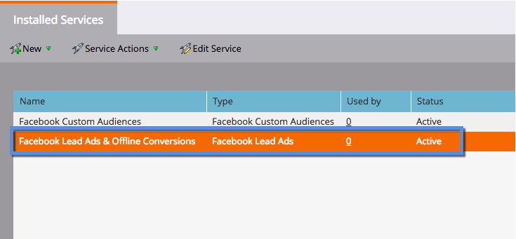
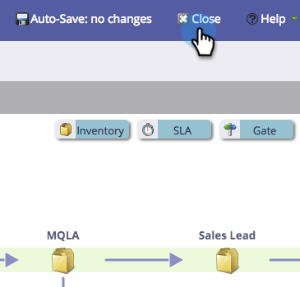

# [!DNL Facebook] 오프라인 전환 설정 {#set-up-facebook-offline-conversions}

잠재 고객 광고를 통해 만든 사람에 대한 오프라인 전환 데이터를 [!DNL Facebook]&#x200B;(으)로 다시 보내면 광고 팀이 광고 비용을 그 어느 때보다 최적화할 수 있습니다. 설정하려면 다음 단계를 따르십시오.

>[!PREREQUISITES]
>
>[Facebook 리드 광고를 설정](/help/marketo/product-docs/demand-generation/facebook/set-up-facebook-lead-ads.md)해야 합니다.

## 관리자 구성 {#admin-configuration}

1. Marketo **[!UICONTROL Admin]**(으)로 이동합니다.

   

1. **[!UICONTROL LaunchPoint]**(으)로 이동하여 이전에 만든 Facebook 리드 광고 서비스를 두 번 클릭합니다.

   >[!NOTE]
   >
   >아직 수행하지 않았다면 [[!UICONTROL Facebook Lead Ads]](/help/marketo/product-docs/demand-generation/facebook/set-up-facebook-lead-ads.md)을(를) 설정한 다음 여기로 돌아오십시오.

   

1. 원하는 경우 오프라인 전환을 포함하도록 **[!UICONTROL Display Name]**&#x200B;을(를) 편집하세요. **[!UICONTROL Next]**&#x200B;를 클릭합니다.

   

1. **[!UICONTROL Enable Offline Conversions]**&#x200B;을(를) 확인하고 **[!UICONTROL Next]**&#x200B;을(를) 클릭합니다.

   

1. **[!UICONTROL Next]**&#x200B;를 클릭합니다.

   

1. **[!UICONTROL Save]**&#x200B;를 클릭합니다.

   

   [!DNL Facebook]개의 오프라인 전환을 사용하는 작업이 절반으로 완료되었습니다. 수익 주기 Modeler 로 이동하여 단계를 매핑합니다.

   

## 수익 주기 Modeler 구성 {#revenue-cycle-modeler-configuration}

1. **[!UICONTROL Analytics]** 으로 이동합니다.

   

1. 모델을 선택하고 **[!UICONTROL Edit Draft]**&#x200B;을(를) 클릭합니다.

   

   >[!NOTE]
   >
   >현재 수익 주기 단계를 다음에 매핑할 수 있는 이벤트는 10개 [!DNL Facebook]개입니다.
   >
   >* 결제 정보 추가
   >* 장바구니에 추가
   >* 위시리스트에 추가
   >* 등록 완료됨
   >* 체크아웃 시작됨
   >* 개인
   >* 기타
   >* 구매
   >* 검색 결과
   >* 컨텐츠 보기

1. 매핑할 단계를 선택한 다음 **[!UICONTROL Facebook Conversion]** 드롭다운에서 매핑할 [!DNL Facebook] 이벤트를 선택합니다. 이 단계를 반복하여 RCM의 모든 단계를 [!DNL Facebook]의 오프라인 전환 단계에 매핑합니다.

   

1. 매핑이 완료되면 모델을 닫습니다.

   

1. 모델을 승인하면 완료됩니다.

   

   이제 잠재 고객 광고 잠재 고객이 매핑된 단계에 도달하면 보고를 위해 [!DNL Facebook]&#x200B;(으)로 전환됩니다.

   >[!CAUTION]
   >
   >[!DNL Facebook] 계정을 확인하고 모든 [광고가 Marketo 오프라인 전환 이벤트 집합에 연결](https://www.facebook.com/business/url/?href=%2Fbusiness%2Fhelp%2Fwww%2F1776828022605281&cmsid&creative=link&creative_detail=advertiser-help-center&create_type&destination_cms_id&orig_http_referrer)되어 있는지 확인하십시오. 그렇지 않으면 광고 속성이 작동하지 않을 수 있습니다.

   >[!NOTE]
   >
   >오프라인 전환 데이터는 Marketo에서 [!DNL Facebook]&#x200B;(으)로 매일 여러 번 전송됩니다.

>[!MORELIKETHIS]
>
>[오프라인 전환 이해 [!DNL Facebook] 오프라인 전환](/help/marketo/product-docs/demand-generation/facebook/understanding-facebook-offline-conversions.md)
