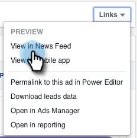
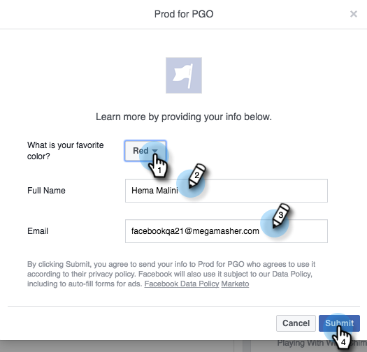
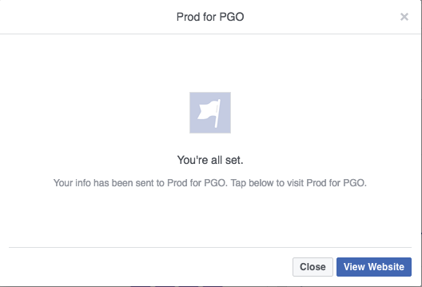
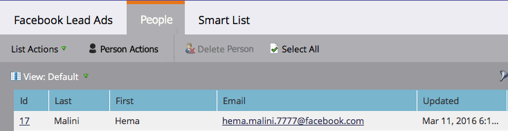

# Marketo과의 데스크톱 통합을 위해 [!DNL Facebook] 리드 광고 테스트 {#test-facebook-lead-ads-for-desktop-integration-with-marketo}

리드 광고를 만든 후 테스트해야 합니다. 다음 단계에 따라 바탕 화면에서 수행합니다.

>[!PREREQUISITES]
>
>[[!UICONTROL Facebook Lead Ads] 통합을 설정](/help/marketo/product-docs/demand-generation/facebook/set-up-facebook-lead-ads.md)해야 합니다.

1. Facebook 파워 편집기에서 캠페인과 광고를 선택하고 **[!UICONTROL Edit]**&#x200B;을(를) 클릭합니다.

1. **[!UICONTROL Links]**&#x200B;에서 **[!UICONTROL View in News Feed]** 링크를 클릭합니다.

   

1. 브라우저의 새 탭에서 [!DNL Facebook]&#x200B;(으)로 이동합니다. [!DNL Facebook] 리드 광고 단위에서 [!UICONTROL Call to Action]을(를) 클릭합니다.

   

   >[!NOTE]
   >
   >다음은 자세히 알아보기 Call to action을 사용하는 예입니다. 리드 광고 단위 Call to action이 다를 수 있습니다.

1. 데스크톱에서 양식을 작성하여 테스트 리드 광고 단위를 제출합니다. **[!UICONTROL Submit]**&#x200B;를 클릭합니다.

   

1. 리드 광고 양식 제출을 완료했습니다.

   

1. 양식을 제출한 후 [프로그램의 일부로 Marketo에 스마트 목록을 작성](/help/marketo/product-docs/core-marketo-concepts/smart-lists-and-static-lists/creating-a-smart-list/create-a-smart-list.md)하거나, 채워진 [!DNL Facebook] 리드 광고 양식 필터를 사용하는 데이터베이스에 스마트 목록을 작성하십시오. 제출한 양식의 리드 광고 양식 이름을 삽입합니다.

   

1. 이제 **[!UICONTROL People]** 탭을 클릭하여 동기화가 올바르게 작동하는지 확인합니다.

   

>[!MORELIKETHIS]
>
>[설정 [!UICONTROL Facebook Lead Ads]](/help/marketo/product-docs/demand-generation/facebook/set-up-facebook-lead-ads.md)
