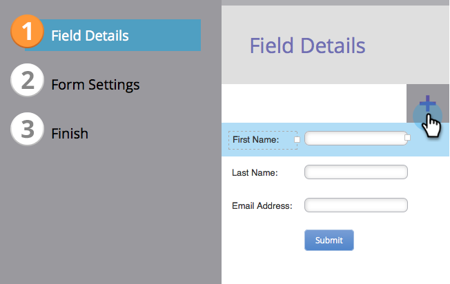
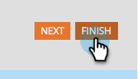

# 양식에 필드 추가 {#add-a-field-to-a-form}

[양식을 만들고](/help/marketo/product-docs/demand-generation/forms/creating-a-form/create-a-form.md){target="_blank"} [테마를 선택하고](/help/marketo/product-docs/demand-generation/forms/creating-a-form/select-a-form-theme.md){target="_blank"}하면 다른 사람이 작성할 필드를 추가할 수 있습니다. 방법은 다음과 같습니다.

1. **[!UICONTROL Marketing Activities]**(으)로 이동합니다.

   

1. 양식을 선택하고 **[!UICONTROL Edit Draft]** 클릭

   

   >[!NOTE]
   >
   >원하는 양식이 _승인됨_ 상태인 경우 먼저 **초안 만들기**&#x200B;를 클릭해야 합니다.

1. 양식에서 **+** 기호를 클릭합니다.

   

   >[!NOTE]
   >
   >새 양식을 만들면 [!UICONTROL First Name], [!UICONTROL Last Name] 및 [!UICONTROL Email Address]이(가) 자동으로 추가됩니다.

1. 양식에 추가할 필드를 찾아 선택합니다.

   

1. 필요한 만큼 필드를 추가하고 **[!UICONTROL Finish]**&#x200B;을(를) 클릭합니다.

   

1. **[!UICONTROL Approve and Close]**&#x200B;을(를) 클릭합니다.

   

>[!NOTE]
>
>양식 변경으로 인해 생성된 모든 랜딩 페이지 초안을 승인해야 합니다.

>[!MORELIKETHIS]
>
>[양식 필드를 만들어야 함](/help/marketo/product-docs/demand-generation/forms/creating-a-form/make-a-form-field-required.md){target="_blank"}
