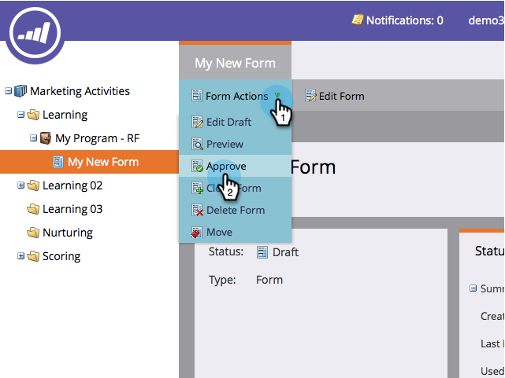

# 양식 승인 {#approve-a-form}

랜딩 페이지 중 하나에 양식을 추가하려면 승인되어야 합니다. 방법

## 양식 승인 {#approve-a-form-1}

기존 양식을 승인할 수 있는 방법을 소개합니다.

1. 마케팅 **활동** 으로 **이동합니다**.

   

1. 양식을 찾아 선택합니다.

   

1. 양식 작업 **에서**&#x200B;승인을 **클릭합니다**.

   

1. 녹색 체크 표시

   

   승인되고 랜딩 페이지에 [추가할 준비가 되었습니다](../../../../product-docs/demand-generation/landing-pages/understanding-landing-pages/approve-unapprove-or-delete-a-landing-page.md).

   >[!NOTE]
   >
   >승인 후 변경한 내용은 포함된 양식에서 업데이트하는 데 최대 4분이 소요됩니다.

## 편집기에서 양식 승인 {#approve-a-form-from-the-editor}

양식을 변경하는 경우 편집기에서 바로 페이지를 승인할 수 있습니다.

>[!NOTE]
>
>**사전 요구 사항**
>
>* [양식 편집](../../../../product-docs/demand-generation/forms/form-actions/edit-a-form.md)

>

1. 마침을 **클릭합니다**.

   

1. 승인 **및 닫기를 클릭합니다**.

   

>[!NOTE]
>
>**미리 알림**
>
>양식을 승인하고 편집한 경우 랜딩 페이지를 [승인하여 변경 사항을 확인합니다](../../../../product-docs/demand-generation/landing-pages/understanding-landing-pages/approve-unapprove-or-delete-a-landing-page.md) .

바로 그거야! 간편하게