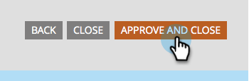

# 양식 승인 {#approve-a-form}

양식을 랜딩 페이지 중 하나에 추가하려면 승인해야 합니다.

## 양식 승인 {#approve}

준비가 완료된 기존 양식을 승인하는 방법은 다음과 같습니다.

1. **[!UICONTROL Marketing Activities]**(으)로 이동합니다.

   

1. 원하는 양식을 선택하고 **[!UICONTROL Approve draft]**&#x200B;을(를) 클릭합니다.

   

   녹색 확인 표시가 나타납니다.

   

   승인되었으며 [랜딩 페이지](/help/marketo/product-docs/demand-generation/landing-pages/understanding-landing-pages/approve-unapprove-or-delete-a-landing-page.md){target="_blank"}에 추가할 준비가 되었습니다.

   >[!NOTE]
   >
   >승인 후 변경한 사항이 임베드된 양식에서 업데이트되는 데 몇 분 정도 걸릴 수 있습니다.

## 편집기에서 양식 승인 {#approve-from-the-editor}

양식 편집기에서 직접 양식을 승인할 수 있습니다.

>[!PREREQUISITES]
>
>[양식 편집](/help/marketo/product-docs/demand-generation/forms/form-actions/edit-a-form.md)

1. 양식에서 **[!UICONTROL Finish]**&#x200B;을(를) 클릭합니다.

   

1. **[!UICONTROL Approve and Close]**&#x200B;를 클릭합니다.

   
