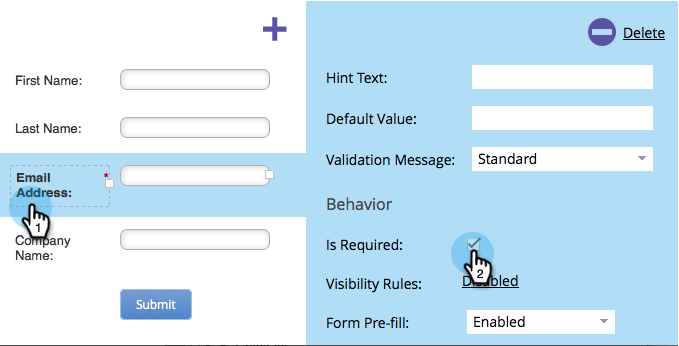
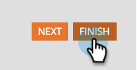

# 양식 필드 필수 항목으로 만들기 {#make-a-form-field-required}

[양식에 필드를 추가](/help/marketo/product-docs/demand-generation/forms/creating-a-form/add-a-field-to-a-form.md){target="_blank"}할 때, 필드를 작성하는 사람에게 몇 가지 필수 필드를 만들 수 있습니다. 방법은 다음과 같습니다.

1. **[!UICONTROL Marketing Activities]**(으)로 이동합니다.

   

1. 양식을 선택하고 **[!UICONTROL Create draft]**&#x200B;을(를) 클릭합니다.

   

   >[!NOTE]
   >
   >양식이 승인되지 않은 경우 **초안 편집**&#x200B;을 클릭하세요.

1. 필요한 필드를 선택하고 **[!UICONTROL Is Required]**&#x200B;을(를) 확인하십시오.

   

1. 잘했어! **[!UICONTROL Finish]**&#x200B;를 클릭합니다.

   

1. **[!UICONTROL Approve and Close]**&#x200B;를 클릭합니다.

   

>[!NOTE]
>
>[모든 랜딩 페이지를 승인](/help/marketo/product-docs/demand-generation/landing-pages/understanding-landing-pages/approve-unapprove-or-delete-a-landing-page.md){target="_blank"}하는 것을 잊지 마십시오. 변경 내용을 실행에 옮기기 위해 이 양식이 적용됩니다.

>[!MORELIKETHIS]
>
>[양식에 추가한 필드 순서 바꾸기](/help/marketo/product-docs/demand-generation/forms/form-fields/reorder-fields-in-a-form.md){target="_blank"}
