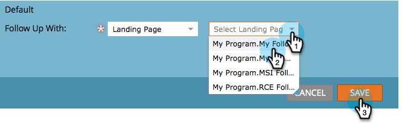

# 양식 감사 인사 페이지 {#set-a-form-thank-you-page} 설정

누군가 양식을 작성하면 어떻게 됩니까? 그들은 어디로 보내졌는가? 구성 방법

## 양식 편집 {#edit-form}

1. **마케팅 활동**&#x200B;으로 이동합니다.

   

1. 양식을 선택하고 **양식 편집**&#x200B;을 클릭합니다.

   

1. **양식 설정** 아래에서 **설정**&#x200B;을 클릭합니다.

   

1. **감사 페이지** 섹션으로 스크롤합니다.

## 페이지에서 유지 {#stay-on-page}

양식이 제출되면 방문자가 동일한 페이지를 방문하도록 합니다.

1. **추가 작업**&#x200B;에 대해 **페이지에 남음**&#x200B;을 선택합니다.

   

## 외부 URL {#external-url}

[외부 URL] 설정을 사용하면 모든 URL을 후속 페이지로 정의할 수 있습니다. 사용자가 양식을 제출하면 지정된 URL로 이동됩니다.

1. **후속 작업**&#x200B;에 대해 **외부 URL**&#x200B;을 선택합니다.

   

1. 전체 URL을 입력합니다.

   

>[!TIP]
>
>URL은 어디에든지 호스팅되는 파일의 URL일 수 있습니다. 이렇게 하면 &quot;제출&quot; 단추가 &quot;다운로드&quot; 단추처럼 동작합니다.

## 랜딩 페이지 {#landing-page}

승인된 마케팅 랜딩 페이지를 후속 작업으로 선택할 수 있습니다.

1. **Follow Up With**&#x200B;을 **랜딩 페이지**&#x200B;로 설정합니다.

   

1. 원하는 랜딩 페이지를 찾아 선택합니다.

   

## 동적 감사 인사 페이지 {#dynamic-thank-you-pages}

여러 옵션을 추가하고 선택 사항을 작성하여 응답에 따라 다른 후속 작업을 표시할 수 있습니다.

1. **선택 추가**&#x200B;를 클릭합니다.

   

1. 응답을 모니터링할 필드를 선택합니다.

   

   >[!TIP]
   >
   >양식에 추가된 필드만 사용할 수 있습니다.

1. 원하는 논리 연산자를 선택합니다.

   

1. 사용자가 응답할 값 중 하나를 입력합니다.

   

1. **추가 작업** 유형에 적합한 페이지를 선택합니다.

   

1. 적절한 랜딩 페이지를 선택합니다.

   

   >[!NOTE]
   >
   >이러한 랜딩 페이지를 미리 생성/승인해야 합니다.

1. 다른 선택을 추가하려면 **+** 기호를 클릭합니다.

   

   >[!NOTE]
   >
   >여러 가지 선택 사항을 추가할 수 있습니다. 그러나 너무 많이 추가하면 양식의 로드 속도에 영향을 줄 수 있으므로 필요한 것만 추가할 수 있습니다.

1. 진행하여 **선택 2**&#x200B;을 설정합니다.

   

   >[!TIP]
   >
   >추가 유형을 자유롭게 조합하여 사용할 수 있습니다. 랜딩 페이지는 한 선택 항목에 사용하고 다른 페이지에 대해서는 URL을 사용할 수 있습니다.

1. 다른 모든 응답에 대해 기본 페이지를 설정합니다.

   

1. 페이지 자체를 선택하고 **저장**&#x200B;을 클릭합니다.

   

   좋아 보여

   

1. **완료**&#x200B;를 클릭합니다.

   

1. **승인 및 닫기**&#x200B;를 클릭합니다.

   

잘했어요!

