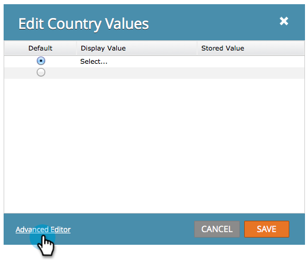

# 양식에 국가 선택 목록 추가 {#add-a-country-picklist-to-your-form}

다음 지침에 따라 모든 국가 목록이 포함된 드롭다운으로 국가 필드를 변환합니다.

1. **[!UICONTROL Marketing Activities]**(으)로 이동합니다.

   

1. 양식을 선택하고 **[!UICONTROL Edit Form]**&#x200B;을(를) 클릭합니다.

   

1. **+** 기호를 클릭합니다.

   

1. **[!UICONTROL Country]**&#x200B;을(를) 찾아 선택합니다.

   

1. **[!UICONTROL Country]** 필드를 선택하여 **[!UICONTROL Field Type]**&#x200B;을(를) **[!UICONTROL Select]**(으)로 변경합니다.

   

1. **[!UICONTROL Edit]** **[!UICONTROL Values]**&#x200B;을(를) 선택하여 사용자가 선택할 수 있는 국가 목록을 추가합니다.

   

1. **[!UICONTROL Advanced Editor]**&#x200B;을(를) 클릭합니다.

   

1. 이 국가 목록 선택 및 복사:

   ```
   Afghanistan Albania Algeria Andorra Angola Antigua & Deps Argentina Armenia Australia Austria Azerbaijan Bahamas Bahrain Bangladesh Barbados Belarus Belgium Belize Benin Bhutan Bolivia Bosnia Herzegovina Botswana Brazil Brunei Bulgaria Burkina Burundi Cambodia Cameroon Canada Cape Verde Central African Rep Chad Chile China Colombia Comoros Congo Congo (Democratic Rep) Costa Rica Croatia Cuba Cyprus Czech Republic Denmark Djibouti Dominica Dominican Republic East Timor Ecuador Egypt El Salvador Equatorial Guinea Eritrea Estonia Ethiopia Fiji Finland France Gabon Gambia Georgia Germany Ghana Greece Grenada Guatemala Guinea Guinea-Bissau Guyana Haiti Honduras Hungary Iceland India Indonesia Iran Iraq Ireland (Republic) Israel Italy Ivory Coast Jamaica Japan Jordan Kazakhstan Kenya Kiribati Korea North Korea South Kosovo Kuwait Kyrgyzstan Laos Latvia Lebanon Lesotho Liberia Libya Liechtenstein Lithuania Luxembourg Macedonia Madagascar Malawi Malaysia Maldives Mali Malta Marshall Islands Mauritania Mauritius Mexico Micronesia Moldova Monaco Mongolia Montenegro Morocco Mozambique Myanmar (Burma) Namibia Nauru Nepal Netherlands New Zealand Nicaragua Niger Nigeria Norway Oman Pakistan Palau Panama Papua New Guinea Paraguay Peru Philippines Poland Portugal Qatar Romania Russian Federation Rwanda St Kitts & Nevis St Lucia Saint Vincent & the Grenadines Samoa San Marino Sao Tome & Principe Saudi Arabia Senegal Serbia Seychelles Sierra Leone Singapore Slovakia Slovenia Solomon Islands Somalia South Africa South Sudan Spain Sri Lanka Sudan Suriname Swaziland Sweden Switzerland Syria Taiwan Tajikistan Tanzania Thailand Togo Tonga Trinidad & Tobago Tunisia Turkey Turkmenistan Tuvalu Uganda Ukraine United Arab Emirates United Kingdom United States Uruguay Uzbekistan Vanuatu Vatican City Venezuela Vietnam Yemen Zambia Zimbabwe
   ```

1. 목록을 편집기에 붙여 넣습니다.

   

   >[!TIP]
   >
   >자유롭게 목록을 편집하거나 다른 목록을 사용하십시오.

1. **[!UICONTROL Save]**&#x200B;을(를) 클릭합니다.

   

1. **[!UICONTROL Finish]**&#x200B;을(를) 클릭합니다.

   

1. **[!UICONTROL Approve and Close]**&#x200B;을(를) 클릭합니다.

   

   잘했어! 이제 사용자가 양식을 작성할 때 사용자가 제공한 국가 목록에서 선택할 수 있습니다.

   

그게 그렇게 쉬웠으니, 왜 더 안 되겠어? 사용자가 목록에서 미국을 국가로 선택할 때 상태 필드를 동적으로 표시하는 것은 어떻습니까? 방법을 알아보려면 아래 관련 문서를 확인하십시오.

>[!MORELIKETHIS]
>
>[양식 필드의 가시성을 동적으로 전환](/help/marketo/product-docs/demand-generation/forms/form-fields/dynamically-toggle-visibility-of-a-form-field.md)
