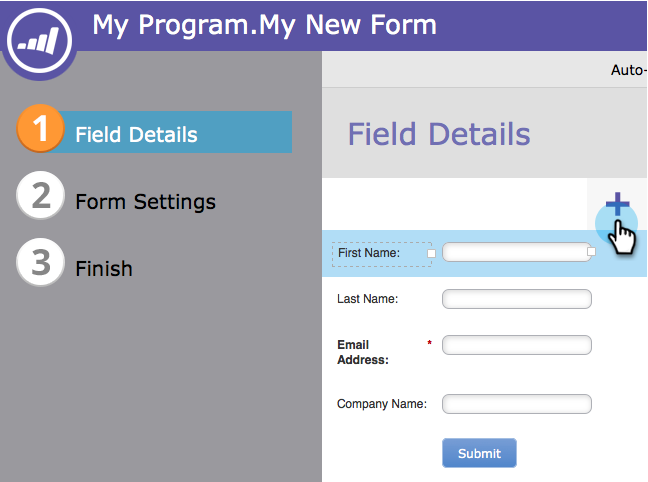
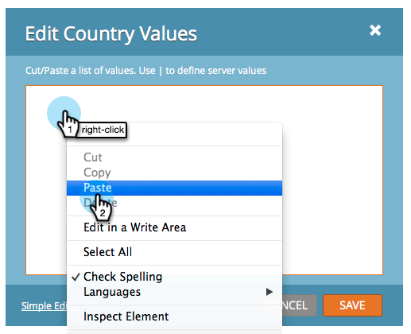

# 양식에 국가 선택 목록 추가 {#add-a-country-picklist-to-your-form}

다음 지침에 따라 국가 필드를 모든 국가 목록과 함께 드롭다운으로 변환합니다.

1. 마케팅 **활동** 으로 **이동합니다**.

   

1. 양식을 선택하고 양식 **편집을** **클릭합니다**.

   

1. ** +* 기호를 클릭합니다.

   

1. 국가 **를 찾아 선택합니다**.

   

1. 국가 **필드** 가 선택된 상태에서 필드 **** 유형 **** 을 **선택**&#x200B;으로 변경합니다.

   

1. **값****을 편집하여** 사용자가 선택할 수 있는 국가 목록을 추가합니다.

   

1. 고급 **편집기를** **클릭합니다**.

   

1. 다음 국가 목록을 선택하고 복사합니다.

   `<pre data-theme="Confluence">Afghanistan Albania Algeria Andorra Angola Antigua & Deps Argentina Armenia Australia Austria Azerbaijan Bahamas Bahrain Bangladesh Barbados Belarus Belgium Belize Benin Bhutan Bolivia Bosnia Herzegovina Botswana Brazil Brunei Bulgaria Burkina Burundi Cambodia Cameroon Canada Cape Verde Central African Rep Chad Chile China Colombia Comoros Congo Congo (Democratic Rep) Costa Rica Croatia Cuba Cyprus Czech Republic Denmark Djibouti Dominica Dominican Republic East Timor Ecuador Egypt El Salvador Equatorial Guinea Eritrea Estonia Ethiopia Fiji Finland France Gabon Gambia Georgia Germany Ghana Greece Grenada Guatemala Guinea Guinea-Bissau Guyana Haiti Honduras Hungary Iceland India Indonesia Iran Iraq Ireland (Republic) Israel Italy Ivory Coast Jamaica Japan Jordan Kazakhstan Kenya Kiribati Korea North Korea South Kosovo Kuwait Kyrgyzstan Laos Latvia Lebanon Lesotho Liberia Libya Liechtenstein Lithuania Luxembourg Macedonia Madagascar Malawi Malaysia Maldives Mali Malta Marshall Islands Mauritania Mauritius Mexico Micronesia Moldova Monaco Mongolia Montenegro Morocco Mozambique Myanmar (Burma) Namibia Nauru Nepal Netherlands New Zealand Nicaragua Niger Nigeria Norway Oman Pakistan Palau Panama Papua New Guinea Paraguay Peru Philippines Poland Portugal Qatar Romania Russian Federation Rwanda St Kitts & Nevis St Lucia Saint Vincent & the Grenadines Samoa San Marino Sao Tome & Principe Saudi Arabia Senegal Serbia Seychelles Sierra Leone Singapore Slovakia Slovenia Solomon Islands Somalia South Africa South Sudan Spain Sri Lanka Sudan Suriname Swaziland Sweden Switzerland Syria Taiwan Tajikistan Tanzania Thailand Togo Tonga Trinidad & Tobago Tunisia Turkey Turkmenistan Tuvalu Uganda Ukraine United Arab Emirates United Kingdom United States Uruguay Uzbekistan Vanuatu Vatican City Venezuela Vietnam Yemen Zambia Zimbabwe</pre>`

1. 목록을 편집기에 붙여넣습니다.

   

   >[!TIP]
   >
   >목록을 편집하거나 다른 목록을 사용하십시오.

1. 저장을 **클릭합니다**.

   

1. 마침을 **클릭합니다**.

   

1. 승인 **및 닫기를 클릭합니다**.

   

   잘 했어! 이제 사용자가 양식을 작성하면 제공한 국가 목록에서 선택할 수 있습니다.

   

그게 너무 쉬웠기 때문에 더 이상은 안 하는 게 어때? 사용자가 목록에서 국가를 선택하여 [주] 필드를 동적으로 표시하는 것은 어떻습니까? 아래 관련 문서를 참조하여 사용 방법을 확인하십시오.

>[!NOTE]
>
>**관련 문서**
>
>* [동적으로 양식 필드의 표시 여부 전환](../../../../product-docs/demand-generation/forms/form-fields/dynamically-toggle-visibility-of-a-form-field.md)

>

