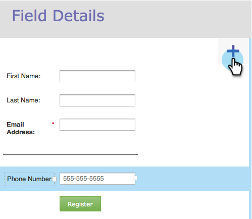

# 양식에 서식 있는 텍스트 추가 {#add-rich-text-to-a-form}

양식의 리치 텍스트를 사용하여 필드 사이에 지침 또는 기타 정보를 추가합니다. 확인해 보십시오.

1. 마케팅 **활동** 으로 **이동합니다**.

   

1. 양식을 선택하고 양식 **편집을** **클릭합니다**.

   

1. Click the **+** sign.

   

1. 리치 **텍스트를 선택합니다**.

   

1. 원하는 텍스트를 입력합니다.

   

   >[!TIP]
   >
   >양식에 줄 구분 기호가 필요한 경우 [가로 선] 단추를 사용합니다.

1. 저장을 **클릭합니다**.

   

1. 마침을 **클릭합니다**.

   

1. 승인 **및 닫기를 클릭합니다**.

   

   잘 했어! 확인해 보십시오.

   

>[!NOTE]
>
>**딥 다이브**
>
>양식에 대한 자세한 [내용](http://docs.marketo.com/display/docs/forms).

또한 리치 텍스트 블록에 가시성 규칙을 [추가할](../../../../product-docs/demand-generation/forms/form-fields/dynamically-toggle-visibility-of-a-form-field.md) 수 있다는 사실을 알고 계십니까?