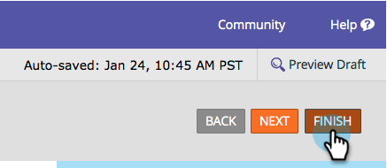

# 양식에 서식 있는 텍스트 추가 {#add-rich-text-to-a-form}

양식의 리치 텍스트 를 사용하여 필드 사이에 지침이나 기타 정보를 추가할 수 있습니다. 확인해 봐.

1. 다음으로 이동 **마케팅 활동**.

   

1. 양식을 선택하고 **양식 편집**.

   

1. 다음을 클릭합니다. **+** 서명.

   

1. 선택 **리치 텍스트**.

   

1. 원하는 텍스트를 입력합니다.

   

   >[!TIP]
   >
   >양식에 줄 구분자가 필요한 경우 가로 줄 단추를 사용합니다.

1. 클릭 **저장**.

   

1. 클릭 **완료**.

   

1. 클릭 **승인 및 닫기**.

   

   잘했어! 확인해 봐.

   

>[!TIP]
>
>너도 할 수 있다는 거 알고 있었어? [가시성 규칙 추가](/help/marketo/product-docs/demand-generation/forms/form-fields/dynamically-toggle-visibility-of-a-form-field.md) 서식 있는 텍스트 블록에 연결하시겠습니까?
