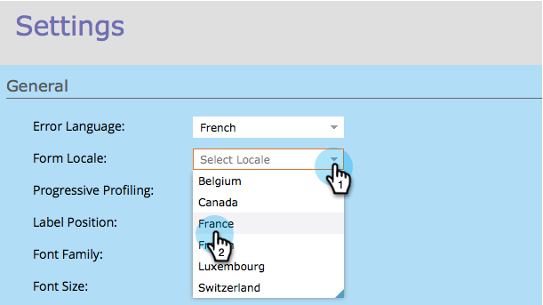

# 양식 로케일 변경 {#change-a-forms-locale}

국제 양식을 처리할 때 날짜/시간을 올바른 형식으로 표시해야 합니다. Marketing Cloud에서 자동으로 수행합니다. 이제 양식 로케일을 설정하기만 하면 됩니다. 나머지 작업은 Adobe에서 처리합니다.

1. 마케팅 **활동** 으로 **이동합니다**.

   

1. 양식을 선택하고 양식 **편집을** **클릭합니다**.

   

1. 양식 **설정****에서**&#x200B;설정을 **클릭합니다**.

   

1. 원하는 **로케일을** 선택합니다.

   

1. 마침을 **클릭합니다**.

   

1. **승인 및 닫기 **를 클릭하여 변경 사항을 적용하고 저장합니다.

   >[!NOTE]
   >
   >랜딩 페이지에서 사용하려면 양식을 승인해야 합니다.

   

   >[!NOTE]
   >
   >**미리 알림**
   >
   >
   >양식 변경에 의해 생성된 랜딩 페이지 초안을 [승인해야](../../../../product-docs/demand-generation/landing-pages/understanding-landing-pages/approve-unapprove-or-delete-a-landing-page.md) 합니다.

1. 
1. 바로 그거야! 사람들은 올바른 로케일에서 표시되는 날짜/시간을 볼 수 있습니다.

   

