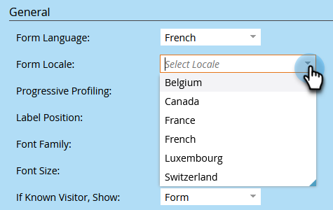

# 양식의 언어 변경 {#change-the-language-of-a-form}

양식의 언어를 변경하는 방법에 대해 알아봅니다.

>[!IMPORTANT]
>
>이 문서의 단계에 따라 Marketo 표준 필드의 언어와 제출 단추 레이블에 사용되는 문구가 변경됩니다. [사용자 지정 필드](/help/marketo/product-docs/administration/field-management/create-a-custom-field-in-marketo.md){target="_blank"}을(를) 번역하지 않습니다.

1. **마케팅 활동**(으)로 이동합니다.

   

1. 양식을 선택하고 **양식 편집**&#x200B;을 클릭합니다.

   

1. **양식 설정**&#x200B;을 클릭하고 **설정**&#x200B;을 선택합니다.

   

1. 원하는 **양식 언어**&#x200B;를 선택합니다.

   

   선택 사항 단계: 선택한 언어의 로케일/지역을 선택합니다.

   

1. **마침을 클릭합니다**.

   

1. 변경 내용을 적용하고 저장하려면 **승인 및 닫기**&#x200B;를 클릭하십시오.

   

   >[!NOTE]
   >
   >양식이 랜딩 페이지에서 사용되도록 승인되어야 합니다.

   >[!TIP]
   >
   >양식 변경으로 만든 [랜딩 페이지 승인](/help/marketo/product-docs/demand-generation/landing-pages/understanding-landing-pages/approve-unapprove-or-delete-a-landing-page.md) 초안을 잊지 마십시오.

이제 선택한 언어가 양식에 반영됩니다.

