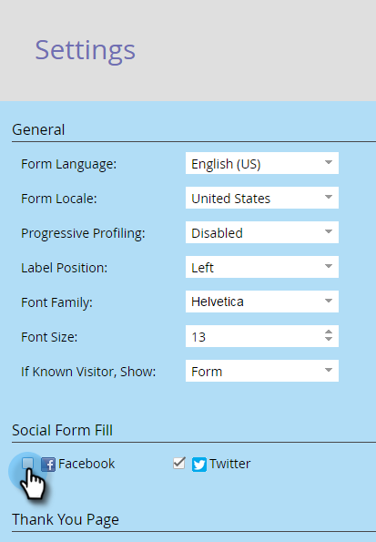

# 소셜 양식 채우기 비활성화 {#disable-social-form-fill}

사이트 방문자가 소셜 프로필을 사용하여 양식을 제출하지 않는 경우도 있습니다. 비활성화하는 방법

>[!NOTE]
>
>**가용성**
>
>모든 고객이 이 기능을 구입하지는 않았습니다.

1. **마케팅 활동**&#x200B;으로 이동합니다.

   

1. 양식을 선택하고 **편집 ****양식**&#x200B;을 클릭합니다.

   

1. 양식 설정에서 **설정**&#x200B;을 클릭합니다.

   

1. 포함하지 않을 소셜 네트워크의 확인란을 선택 취소합니다.

   

1. **완료**&#x200B;를 클릭합니다.

   

1. **승인 및 닫기**&#x200B;를 클릭합니다.

   

   그게 네가 해야 할 전부야

