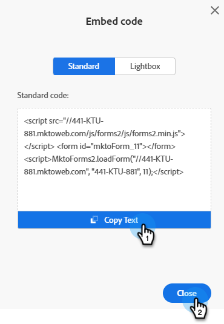

# 웹 사이트에 양식 임베드 {#embed-a-form-on-your-website}

양식의 포함 코드에 액세스하여 이를 자체 웹 사이트에서 호스팅합니다.

>[!PREREQUISITES]
>
>포함 코드를 사용하려면 양식을 승인해야 합니다.

1. 원하는 양식을 찾아 선택합니다.

   

1. 양식 세부 정보 화면 오른쪽에서 **[!UICONTROL Embed code]**&#x200B;을(를) 클릭합니다.

   

   >[!CAUTION]
   >
   >Marketo 랜딩 페이지에서 사용자 페이지 _또는_&#x200B;에서 양식 포함 코드를 사용할 때 **[양식 미리 채우기](/help/marketo/product-docs/administration/settings/edit-landing-page-settings.md)**&#x200B;가 작동하지 않습니다. 양식 미리 채우기는 양식을 Marketo 랜딩 페이지에서 요소 삽입 옵션을 통해 사용할 때만 작동합니다.

1. _표준_ 탭에서 **[!UICONTROL Copy Text]**&#x200B;을(를) 클릭합니다. 완료되면 **[!UICONTROL Close]**&#x200B;를 클릭합니다.

   

   >[!NOTE]
   >
   >Lightbox 코드에 대해서는 [Lightbox에서 양식 사용](/help/marketo/product-docs/demand-generation/forms/form-actions/use-a-form-in-a-lightbox.md)을 참조하십시오.

1. 웹 개발자에게 포함 코드를 제공합니다.

   코드가 웹 사이트에 포함되면 양식 승인 시 Marketo Engage의 양식에 대한 모든 변경 사항이 사이트에 푸시됩니다. 코드를 변경할 필요가 없습니다.

   >[!TIP]
   >
   >개발자가 디자인을 사용자 지정하거나 고급 API 함수에 액세스하려면 [Forms 2.0 개발자 페이지](https://experienceleague.adobe.com/en/docs/marketo-developer/marketo/javascriptapi/forms-api-reference)를 표시하십시오.
