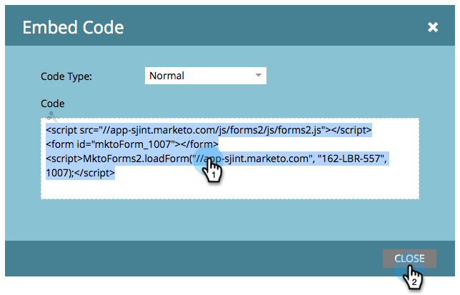

# 웹 사이트에 양식 포함 {#embed-a-form-on-your-website}

Marketing에서는 웹 사이트에 Adobe 양식을 포함할 수 있습니다. 포함 코드에 대한 액세스 방법은 다음과 같습니다.

1. **마케팅 활동**&#x200B;으로 이동합니다.

   

1. 양식을 찾아 선택합니다.

   

1. **양식 작업**&#x200B;에서 **포함 코드**&#x200B;를 클릭합니다.

   >[!NOTE]
   >
   >**포함 코드** 항목을 표시/사용할 수 있도록 하려면 양식을 승인해야 합니다.

   

   >[!CAUTION]
   >
   >**[양식](/help/marketo/product-docs/administration/settings/edit-landing-page-settings.md)** 프리플라이트 기능은 자체 페이지 또는 Marketing 랜딩 페이지에서 양식 포함 코드를 사용할  __ 때 작동하지 않습니다. 양식 미리 보기는 요소가 삽입 옵션을 통해 마커 랜딩 페이지에서 양식이 사용될 때만 작동합니다.

1. 포함 코드를 선택/복사한 다음 **닫기**&#x200B;를 클릭합니다.

   

>[!TIP]
>
>코드가 웹 사이트에 삽입되면, Marketing To에서 양식에 대한 변경 사항은 양식 승인 시 사이트로 푸시됩니다. 코드를 변경할 필요가 없습니다.

이제 웹 개발자에게 임베드 코드를 제공하여 웹 개발자에게 사이트를 추가하면 됩니다.

>[!NOTE]
>
>개발자가 모양을 사용자 정의하거나 고급 API 기능에 액세스하려면 [Forms 2.0 개발자 페이지](https://developers.marketo.com/documentation/websites/forms-2-0/)를 표시합니다.

잘했어요! [포함 코드에 lightbox 코드](/help/marketo/product-docs/demand-generation/forms/form-actions/use-a-form-in-a-lightbox.md)를 포함하시겠습니까? 그것도 간단해!
