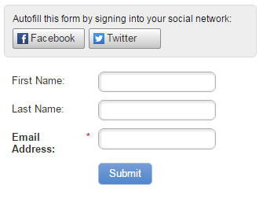

# 양식에서 소셜 양식 채우기 활성화 {#enable-social-form-fill-on-a-form}

방문자가 소셜 네트워크를 사용하여 양식을 작성할 수 있도록 허용합니다. 추가 데이터가 자동으로 제공되며 더 빠른 경험을 얻을 수 있습니다.

>[!AVAILABILITY]
>
>모든 Marketo Engage 사용자가 이 기능을 구입한 것은 아닙니다. 자세한 내용은 Adobe 계정 팀(계정 관리자)에 문의하십시오.

1. **[!UICONTROL Marketing Activities]** 으로 이동합니다.

   

1. 양식을 선택하고 **[!UICONTROL Edit Form]**&#x200B;을(를) 클릭합니다.

   

1. **[!UICONTROL Form Settings]**&#x200B;에서 **[!UICONTROL Settings]**&#x200B;을(를) 클릭합니다.

   

1. 포함할 소셜 네트워크 단추를 확인하십시오.

   

   >[!TIP]
   >
   >사람들이 소셜 단추를 사용하는 경우 _Marketo에서 캡처할 데이터_&#x200B;를 살펴보십시오.

1. **[!UICONTROL Finish]**&#x200B;를 클릭합니다.

   

1. **[!UICONTROL Approve and Close]**&#x200B;를 클릭합니다.

   

   여기 있습니다.

   

꽤 멋지지?
