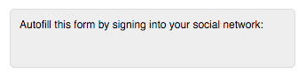

# LinkedIn 소셜 양식 채우기 FAQ {#linkedin-social-form-fill-faqs}

LinkedIn의 수정된 API 정책을 사용하려면 제품에서 LinkedIn 소셜 양식 채우기를 제거해야 합니다.

## {#important-things-to-know}을(를) 알아야 할 중요 사항

* 2016년 4월 28일 현재 LinkedIn 소셜 양식 채우기 단추가 더 이상 Marketing에 추가되는 옵션이 아닙니다

* 활성화한 모든 양식에서 LinkedIn 소셜 양식 채우기 단추를 제거했습니다

## Marketing To 구독에서 이 기능이 제거된 이유는 무엇입니까?{#why-was-this-functionality-removed-from-my-marketo-subscription}

LinkedIn은 개발자 프로그램에 몇 가지 중요한 변경 사항을 적용했습니다. 이러한 변경 사항의 일부로서 Marketing은 더 이상 고객을 위해 이 기능을 지원할 수 없습니다.

## 소셜 양식이 활성화된 양식에서 LinkedIn 소셜 양식 채우기 단추를 제거하지 않으면 어떻게 됩니까?{#what-happened-if-i-didnt-remove-the-linkedin-social-form-fill-buttons-from-my-forms-that-had-social-form-enabled}

2016년 4월 28일에 Social 양식이 활성화된 양식에서 LinkedIn 소셜 양식 채우기 단추를 제거했습니다.

## Adobe가 Marketing To 고객이 된 이후 이 기능을 양식에 삽입했습니다. LinkedIn 소셜 양식 채우기를 사용한 양식을 어떻게 알 수 있습니까?{#i-have-been-inserting-this-functionality-on-forms-since-we-became-a-marketo-customer-how-do-i-know-which-forms-were-using-linkedin-social-form-fill}

이 변경 전에 LinkedIn Social 양식 채우기를 사용한 양식 목록이 포함된 주별 알림을 받은 편지함으로 전송했습니다. 이러한 경고는 이 기능을 사용하는 위치를 식별하기 위한 것입니다.

## LinkedIn 소셜 공유 단추가 여전히 작동합니까?{#do-linkedin-social-sharing-buttons-still-work}

네. 변경 사항은 LinkedIn 소셜 양식 채우기 기능에만 영향을 줍니다.

## Facebook 및 Twitter 소셜 양식 채우기가 여전히 작동합니까?{#do-facebook-and-twitter-social-form-fill-still-work}

네. Facebook 및 Twitter 소셜 양식 채우기는 변경되지 않았습니다.

## LinkedIn 소셜 양식 채우기를 통해 이미 캡처한 데이터에 아무 문제가 발생했습니까?{#did-anything-happen-to-the-data-we-already-captured-via-linkedin-social-form-fill}

아니요. 이 데이터는 이미 Marketing의 개인 레코드에 저장되었으며 이 변경의 영향을 받지 않았습니다.

## LinkedIn의 API 정책에 대한 자세한 내용은 어디에서 찾을 수 있습니까?{#where-can-i-find-more-information-about-linkedin-s-api-policy}

API 정책에 대한 LinkedIn의 변경 사항에 대해 자세히 알아보려면 이 링크를 따르십시오.[https://developer.linkedin.com/blog/posts/2015/developer-program-changes](https://developer.linkedin.com/blog/posts/2015/developer-program-changes)

## 문의 사항은 LinkedIn에 어떻게 문의해야 합니까?{#how-can-i-contact-linkedin-with-questions}

다음 링크를 따라 LinkedIn에 해당 마케팅 솔루션에 대해 문의하십시오.[https://business.linkedin.com/marketing-solutions/contact-us](https://business.linkedin.com/marketing-solutions/contact-us)

## 4월 28일 Marketing Cloud에서 이 기능을 양식에서 제거한 경우, 내 양식 및 해당 랜딩 페이지가 초안 모드에 들어갔습니까?{#if-marketo-removed-this-functionality-from-my-forms-on-april-were-my-forms-and-the-affected-landing-pages-put-into-draft-mode}

아니요. 이 기능을 제거한 양식이 게시되었습니다.

## LinkedIn이 유일한 선택된 네트워크인 경우 내 양식의 모양이 변경됩니까?{#if-linkedin-was-my-only-selected-network-will-this-change-the-appearance-of-my-form}

아니요. 양식에서 LinkedIn 단추만 제거합니다. 소셜 양식 채우기가 양식에 적용될 때마다 이 양식 위에 소셜 양식 채우기 단추가 포함된 컨테이너가 만들어집니다. 2016년 4월 28일 이전에는 LinkedIn이 유일한 옵션인 경우 컨테이너의 외형이 다음 이미지와 유사합니다.

2016년 4월 28일 이후 이제 LinkedIn 소셜 양식 채우기가 제거된 모든 양식의 맨 위에 빈 컨테이너가 남아 있습니다.

>[!NOTE]
>
>위의 이미지는 예시용으로만 제공됩니다. 이는 소셜 양식 채우기 단추 컨테이너가 렌더링하는 방식과는 다를 수 있습니다. 모든 글꼴 색상, 스타일 등 컨테이너가 어떻게 생겼는지에 대한 영향을 선택했습니다.

## LinkedIn이 유일한 선택된 네트워크인 경우 양식 위에 있는 빈 컨테이너를 어떻게 제거할 수 있습니까?{#if-linkedin-was-my-only-selected-network-how-can-i-remove-the-empty-container-above-my-form}

양식을 편집하고, 소셜 양식 채우기에 대한 옵션으로 Facebook 또는 Twitter를 선택한 다음, 소셜 양식 채우기에 대한 옵션으로 Facebook 또는 Twitter를 선택 취소하여 빈 컨테이너를 제거할 수 있습니다. 양식 채우기 컨테이너 내의 소셜 옵션이 재설정되고 양식에서 제거됩니다.
