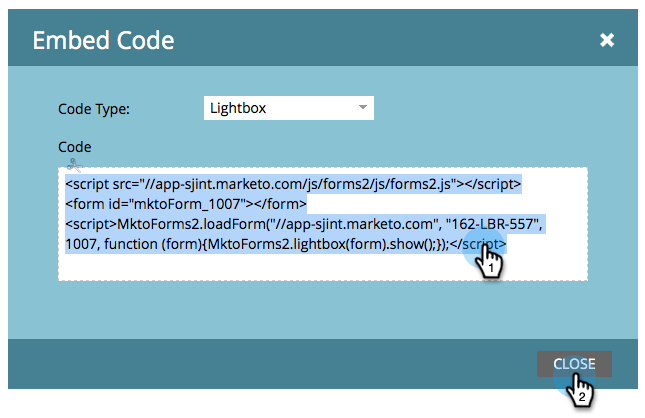

# 라이트박스에서 양식 사용 {#use-a-form-in-a-lightbox}

Lightbox는 표시하려는 콘텐츠 앞에 폼을 여는 기술입니다. 방법은 다음과 같습니다.

1. **[!UICONTROL Marketing Activities]** 으로 이동합니다.

   

1. 양식을 찾아 선택합니다.

   

1. **[!UICONTROL Form Actions]**&#x200B;에서 **[!UICONTROL Embed Code]**&#x200B;을(를) 클릭합니다.

   >[!NOTE]
   >
   >포함 코드 항목을 보거나/사용하려면 양식을 승인해야 합니다.

   

1. **[!UICONTROL Code Type]**&#x200B;을(를) **[!UICONTROL Lightbox]**(으)로 설정합니다.

   

1. 코드를 선택/복사하고 **[!UICONTROL Close]**&#x200B;을(를) 클릭합니다.

   

코드를 웹 개발자에게 넘겨 웹 사이트에 추가하도록 합니다.
