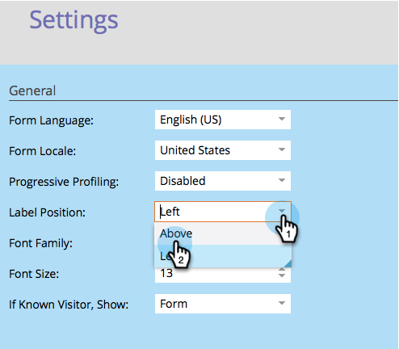

# 양식 레이블 위치 변경 {#change-form-label-position}

[양식을 만들](/help/marketo/product-docs/demand-generation/forms/creating-a-form/create-a-form.md)때 양식 필드 레이블의 위치를 매우 쉽게 변경할 수 있습니다. 방법은 다음과 같습니다.

1. **[!UICONTROL Marketing Activities]** 으로 이동합니다.

   

1. 양식을 선택하고 **[!UICONTROL Edit Form]**&#x200B;을(를) 클릭합니다.

   

1. **[!UICONTROL Settings]**&#x200B;를 선택합니다.

   

1. 원하는 **[!UICONTROL Label Position]**&#x200B;을(를) 선택하십시오.

   

   현재 다음 두 가지 옵션이 있습니다.

   * [!UICONTROL Left]&#x200B;(기본값)
   * [!UICONTROL Above]

1. **[!UICONTROL Finish]**&#x200B;를 클릭합니다.

   

1. **[!UICONTROL Approve and Close]**&#x200B;를 클릭합니다.

   >[!NOTE]
   >
   >양식이 랜딩 페이지에서 사용되도록 승인되어야 합니다.

   

   >[!NOTE]
   >
   >양식 변경으로 생성된 랜딩 페이지 초안을 승인해야 합니다.

잘했어! 양식의 레이블 위치를 변경하는 것이 얼마나 쉬웠는지 살펴보십시오. 좋아요, 양식 라벨의 글꼴을 변경하는 것에 대해 우리가 무엇을 할 수 있는지 알아봅시다.

>[!MORELIKETHIS]
>
>[양식 글꼴 모음 변경](/help/marketo/product-docs/demand-generation/forms/form-design/change-the-form-font-family.md)
