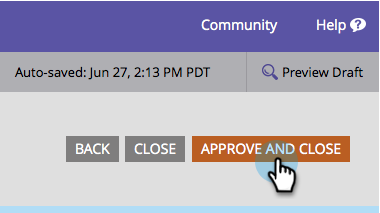

# 양식 제출 단추 텍스트 변경 {#change-form-submit-button-text}

양식 단추를 &quot;제출&quot;에서 다른 단어로 빠르고 쉽게 변경할 수 있습니다. 방법

1. **Marketing** **활동**&#x200B;으로 이동합니다.

   

1. 양식을 선택하고 **편집** **양식**&#x200B;을 클릭합니다.

   

1. 단추를 선택하고 **레이블**&#x200B;을 변경합니다.

   

   >[!TIP]
   >
   >대기 레이블을 변경할 수도 있습니다. 단추를 클릭한 후 양식 제출 작업이 완료되기 전에 표시됩니다.

1. **완료**&#x200B;를 클릭합니다.

   

1. **승인 및 닫기**&#x200B;를 클릭합니다.

   

   밤!

   

