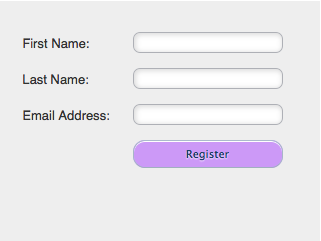

# 전송 단추 스타일 및 색상 변경 {#change-submit-button-style-and-color}

표준 제출 단추가 흐릿하거나 좀 더 멋진 것이 필요한 경우 즉시 사용할 수 있는 다양한 단추 스타일 중에서 선택할 수 있습니다.

1. 마케팅 **활동** 으로 **이동합니다**.

   

1. 양식을 선택하고 양식 **편집을** **클릭합니다**.

   

1. 전송 **단추를** 선택하고 단추 스타일 **옆에 있는** 편집을 클릭합니다.

   

   >[!TIP]
   >
   >제출 버튼을 왼쪽 또는 오른쪽으로 드래그하여 위치를 변경할 수 있다는 사실을 알고 계십니까? 아주 쉬워요 시도해 보세요!

1. 원하는 단추 스타일을 선택합니다(위로/아래로 스크롤).

   

1. 색상을 기본값으로 두거나 사용자 정의할 수 있습니다.

   

   >[!TIP]
   >
   >색상 코드를 수동으로 입력할 수도 있습니다.

1. 선택을 **클릭합니다**.

   

1. 마침을 **클릭합니다**.

   

1. 승인 **및 닫기를 클릭합니다**.

   

   됐다!

   

   >[!NOTE]
   >
   >많은 그래픽 요소와 마찬가지로 사용 중인 브라우저에 따라 단추가 다르게 보일 수 있습니다.

