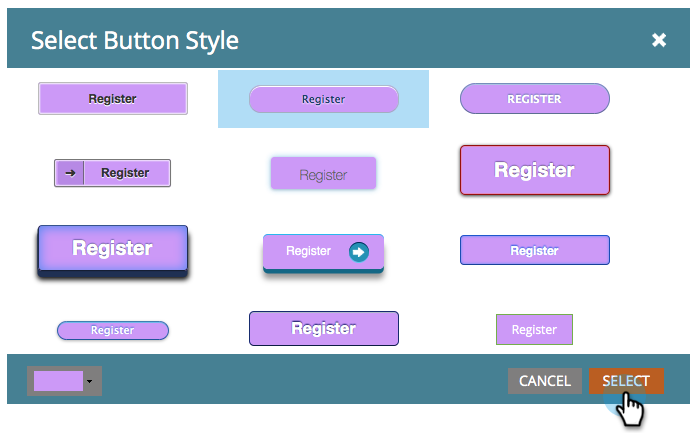

# 전송 단추 스타일 및 색상 변경 {#change-submit-button-style-and-color}

표준 제출 단추가 무디거나 좀 더 화려한 것이 필요한 경우에는 사용할 수 있는 단추 스타일을 다양하게 선택하십시오.

1. **[!UICONTROL Marketing Activities]**(으)로 이동합니다.

   

1. 양식을 선택하고 **[!UICONTROL Edit Form]**&#x200B;을(를) 클릭합니다.

   

1. **[!UICONTROL Submit]** 단추를 선택하고 단추 스타일 옆에 있는 **[!UICONTROL Edit]**&#x200B;을(를) 클릭합니다.

   

   >[!TIP]
   >
   >제출 버튼을 왼쪽이나 오른쪽으로 드래그하여 위치를 변경할 수 있다는 것을 알고 계십니까? 그렇게 쉬워 사용해 보세요!

1. 원하는 단추 스타일을 선택합니다(위/아래로 스크롤).

   

1. 색상을 기본값으로 유지하거나 사용자 정의할 수 있습니다.

   

   >[!TIP]
   >
   >색상 코드를 수동으로 입력할 수도 있습니다.

1. **[!UICONTROL Select]**&#x200B;을(를) 클릭합니다.

   

1. **[!UICONTROL Finish]**&#x200B;을(를) 클릭합니다.

   

1. **[!UICONTROL Approve and Close]**&#x200B;을(를) 클릭합니다.

   

   여기요!

   

   >[!NOTE]
   >
   >많은 그래픽 요소와 마찬가지로 사용 중인 브라우저에 따라 버튼이 다르게 보일 수 있습니다.
