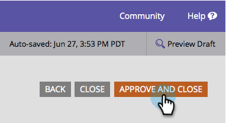

# 양식 글꼴 모음 {#change-the-form-font-family} 변경

Google Fonts는 탁월한 기능을 제공하므로 양식 편집기에 바로 사용할 수 있습니다. 확인!

>[!NOTE]
>
>이 설정은 양식 레이블, 입력 텍스트 및 리치 텍스트에 영향을 줍니다.

1. **Marketing** **활동**&#x200B;으로 이동합니다.

   

1. 양식을 선택하고 **편집** **양식**&#x200B;을 클릭합니다.

   

1. **양식** **설정**&#x200B;에서 **설정**&#x200B;을 선택합니다.

   

1. 원하는 **글꼴 모음**&#x200B;을 선택합니다.

   >[!TIP]
   >
   >[Google 글꼴](http://www.google.com/fonts)을(를) 사용할 수 있습니다.

   

1. **완료**&#x200B;를 클릭합니다.

   

1. **승인 및 닫기**&#x200B;를 클릭합니다.

   >[!NOTE]
   >
   >랜딩 페이지에서 사용하려면 양식을 승인해야 합니다.

   

   >[!NOTE]
   >
   >**미리 알림**
   >
   >
   >양식 변경으로 만든 랜딩 페이지 초안을 승인해야 합니다.

   

양식에서 글꼴 모음을 손쉽게 변경하는 방법을 살펴보십시오. 좋습니다. 이제 양식 글꼴 크기를 변경하는 방법을 알아보겠습니다.

>[!MORELIKETHIS]
>
>* [양식 글꼴 크기 변경](change-the-form-font-size.md)

>

