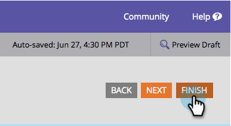

# 양식 글꼴 크기 변경 {#change-the-form-font-size}

Marketing Cloud를 사용하면 양식의 모양과 느낌을 사용자 요구에 맞게 손쉽게 변경할 수 있습니다. 한 가지 원하는 것은 글꼴 크기를 변경하는 것입니다. 방법

>[!TIP]
>
>이 설정은 양식 레이블, 입력 텍스트 및 제출 단추 텍스트에 영향을 줍니다.

1. **마케팅 활동**&#x200B;으로 이동합니다.

   

1. 양식을 선택하고 **양식 편집**&#x200B;을 클릭합니다.

   

1. **양식 설정**&#x200B;에서 **설정**&#x200B;을 선택합니다.

   

1. 원하는 **글꼴 크기**&#x200B;를 선택합니다.

   

1. **완료**&#x200B;를 클릭합니다.

   

1. **승인 및 닫기**&#x200B;를 클릭합니다.

   >[!NOTE]
   >
   >랜딩 페이지에서 사용하려면 양식을 승인해야 합니다.

   

   >[!NOTE]
   >
   >양식 변경으로 만든 랜딩 페이지 초안을 승인해야 합니다.

   

케이크 조각! 네가 알아서 해
