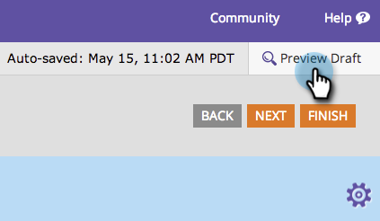

# 양식 테마 {#edit-the-css-of-a-form-theme}의 CSS 편집

](/help/marketo/product-docs/demand-generation/forms/creating-a-form/select-a-form-theme.md)에서 선택한 미리 작성된 [테마가 있습니다. 그러나 CSS 편집을 좋아하는 경우 원하는 대로 변경할 수 있습니다. 방법

>[!NOTE]
>
>사용자 지정 코딩에 도움이 되도록 Marketing To Support가 설정되어 있지 않으므로 이를 시도하려는 경우 CSS에 대해 알고 있어야 합니다. 또한 변경한 내용은 현재 편집 중인 양식에만 적용됩니다.

1. **마케팅 활동**&#x200B;으로 이동합니다.

   

1. 양식을 선택하고 **양식 편집**&#x200B;을 클릭합니다.

   

1. **양식 설정**&#x200B;으로 이동합니다.

   

1. 변경할 테마를 선택합니다.

   

1. 톱니바퀴 아이콘 아래에서 **테마 CSS 보기**&#x200B;를 클릭합니다.

   

1. 이 CSS를 원하는 편집기에 잘라내거나 붙여 넣을 수 있습니다. 읽기 전용이므로 CSS에 대한 대체 내용만 필요합니다.

   

1. **닫기**&#x200B;를 클릭합니다.

   

1. 톱니바퀴 아이콘 아래에서 **사용자 지정 CSS 편집**&#x200B;을 클릭합니다.

   

1. 사용자 지정 CSS를 입력합니다. 모든 것이 필요한 것이 아니라 다른 부분들이죠.

   

1. 완료되면 **저장**&#x200B;을 클릭합니다.

   

1. 사용자 정의된 양식을 보려면 **초안 미리 보기**&#x200B;를 클릭합니다.

   

바로 그거야!
