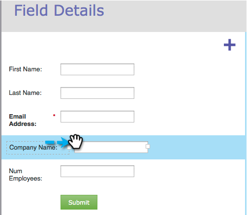

# {#resize-label-field-width-in-a-form} 양식의 레이블/필드 너비 크기 조정

필드 레이블 너비와 필드 너비 자체의 크기를 변경하는 방법은 두 가지가 있습니다.

## 너비 {#drag-and-drop-the-width} 드래그하여 놓기

1. [양식 편집기](../../../../product-docs/demand-generation/forms/form-actions/edit-a-form.md)에서 크기를 조정할 필드를 선택합니다.

   

1. 레이블 모서리 또는 필드 모서리를 드래그하여 크기를 조정합니다.

   

## 수동으로 너비 입력 {#enter-the-width-manually}

1. 크기를 조정할 필드를 선택합니다.

   

1. 레이블 너비 및/또는 필드 너비의 픽셀 값을 입력합니다.

   

잘했어요! 아주 쉬운거지?
