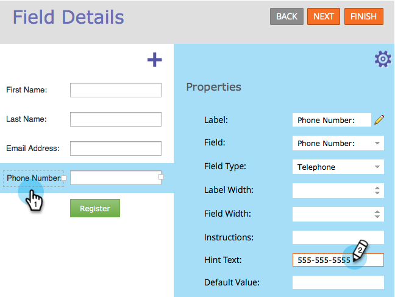

# 양식 필드에 힌트 텍스트 추가 {#add-hint-text-to-a-form-field}

힌트와 [지침](/help/marketo/product-docs/demand-generation/forms/form-fields/add-tooltip-instructions-to-a-form-field.md)은(는) 사람들이 양식을 작성하는 데 도움이 됩니다. 힌트를 추가하는 방법은 다음과 같습니다.

>[!NOTE]
>
>**정의**
>
>**힌트** 양식은 방문자가 필드에서 입력을 시작하면 사라지는 필드 내부의 텍스트입니다.
>
>양식 **지침**&#x200B;은(는) 방문자가 필드 위에 마우스 커서를 놓으면 표시되는 작은 도구 설명입니다.

1. **마케팅 활동**(으)로 이동합니다.

   

1. 양식을 선택하고 **양식 편집**&#x200B;을 클릭합니다.

   

1. 필드를 선택하고 **힌트 텍스트**&#x200B;를 입력하십시오.

   

1. **마침**&#x200B;을 클릭합니다.

   

1. **승인 및 닫기**&#x200B;를 클릭합니다.

   

   >[!NOTE]
   >
   >양식을 변경하여 만든 [랜딩 페이지 초안 승인](/help/marketo/product-docs/demand-generation/landing-pages/understanding-landing-pages/approve-unapprove-or-delete-a-landing-page.md)을 잊지 마십시오.

   

확인해 봐! 이제 [지침](add-tooltip-instructions-to-a-form-field.md)을 추가해 보겠습니다.
