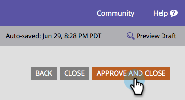

# 양식의 필드에 입력 마스크 적용 {#apply-input-masking-to-a-field-in-a-form}

입력 마스크를 사용하여 방문자의 입력을 제한할 수 있습니다. 예를 들어 방문자가 특정 형식으로만 전화 번호를 입력할 수 있습니다.

1. 마케팅 **활동** 으로 **이동합니다**.

   

1. 양식을 선택하고 양식 **편집을** **클릭합니다**.

   

1. 필드를 선택하고 **필드** 유형 **이 텍스트** 로 **설정되어 있는지**&#x200B;확인합니다.

   >[!NOTE]
   >
   >입력 마스크는 **텍스트 필드 유형에서만 작동합니다**.

   

1. 마스크 **입력** 링크 **를** 클릭합니다.

   

1. 입력 마스크를 입력하고 **저장을 클릭합니다**.

   

   >[!NOTE]
   >
   >마스크 규칙에 주의를 기울입니다. 숫자, 문자, 둘 다 및/또는 입력한 문자 수를 제한할 수 있습니다.

1. 마침을 **클릭합니다**.

   

1. 승인 **및 닫기를 클릭합니다**.

   

   확인! 이제 방문자에게 특정 형식으로 숫자를 입력하도록 요청합니다.

   

   >[!NOTE]
   >
   >이 필드에는 위의 이미지에 표시된 사전 정의된 영역이 표시되지 않을 수 있습니다. 방문자가 숫자를 입력하기 시작할 때까지 비어 있는 상태로 나타날 수 있으며, 이 경우 필드에 대해 정의한 입력 형식을 자동으로 따릅니다.

꽤 멋지죠?
